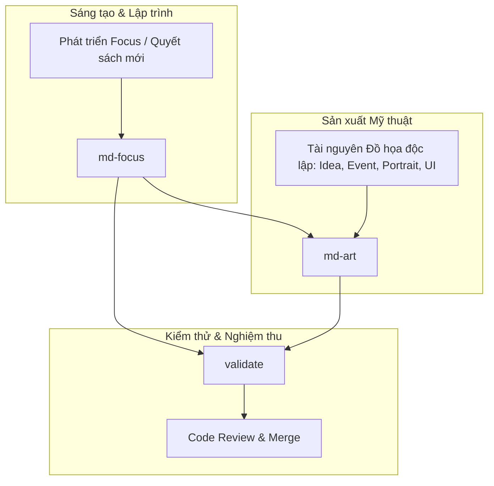

# Millennium Dawn: Vietnam — Hệ thống 3 Kỹ năng Master Chuẩn hóa

Thư mục `.claude/skills/` quản lý tập trung toàn bộ kỹ năng phát triển của submod **MD Vietnam** (Millennium Dawn, HOI4 `1.19.*`).

Hệ thống đã được **tinh gọn và hợp nhất từ 12 kỹ năng phân tán trước đây thành 3 Kỹ năng Trụ cột Toàn diện (3 Master Skills)**, loại bỏ triệt để tình trạng phân mảnh thông tin, chồng chéo tài liệu và giúp quá trình phát triển trở nên trực quan, mạch lạc.

---

## 1. Bản đồ 3 Kỹ năng Trụ cột (Master Skills Architecture)

```
.claude/skills/
├── md-focus/      # [TRỤ CỘT 1] TOÀN BỘ VỀ NATIONAL FOCUS
│                  # Hợp nhất: new-focus + md-focus-standard + quy chuẩn icon focus
│                  # (Quy trình thêm focus, cấu trúc code, kiến trúc nhánh, reward MD, treasury, icon 93x91, loc)
│
├── md-art/        # [TRỤ CỘT 2] TOÀN BỘ VỀ MỸ THUẬT & ĐỒ HỌA SUBMOD
│                  # Hợp nhất: master md-art + 6 module chuyên biệt (Focus, Idea, Decision, Event, Portrait, UI)
│                  # (Chiaroscuro 3 nguồn, NMM, biểu tượng VN, profile đo đạc, unsharp mask, xuất DDS/TGA, GFX)
│
└── validate/      # [TRỤ CỘT 3] TOÀN BỘ VỀ KIỂM THỬ, DỊCH THUẬT & CODE REVIEW
                   # Hợp nhất: validate + loc-check + content-review
                   # (Bộ test tĩnh tự động, audit localisation/mã màu, checklist 7 điểm review PR trước khi merge)
```

---

## 2. Bảng Chi tiết 3 Kỹ năng Master

| STT | Kỹ năng Master | Đường dẫn | Nội dung Hợp nhất | Ngữ cảnh Kích hoạt & Chức năng Chính |
|:---:|---|---|---|---|
| **01** | **`md-focus`** | [`md-focus/`](md-focus/SKILL.md) | • `new-focus`<br>• `md-focus-standard`<br>• `md-focus-art`<br>• `references/` | **Chuyên trách toàn bộ vòng đời của National Focus:**<br>- Quy trình thêm focus mới từ A-Z.<br>- Kiến trúc cây, quy tắc toạ độ, anchor cha-con, mutex.<br>- Cấu trúc code & thứ tự trường dữ liệu chuẩn MD.<br>- Thiết kế reward kinh tế/quân sự, trừ tiền quỹ quốc gia (`treasury_change`).<br>- AI weight và guard modifier.<br>- Tiêu chuẩn xuất icon $93\times 91$ px DDS 33.980B & đăng ký GFX.<br>- Checklist nghiệm thu 15 tiêu chí vàng. |
| **02** | **`md-art`** | [`md-art/`](md-art/SKILL.md) | • `md-art`<br>• 6 consumer sub-modules<br>(Focus, Idea, Decision, Event, Portrait, UI) | **Cẩm nang & Quy trình sản xuất mỹ thuật toàn diện:**<br>- Khoa học màu sắc Chiaroscuro 3 nguồn & kim loại NMM.<br>- Biểu tượng Nhà nước Việt Nam chuẩn xác (Hiến pháp 2013).<br>- Module 1: National Focus ($93\times 91$ px DDS, 33.980B).<br>- Module 2: National Spirit / Idea ($60\times 68$ px DDS, 16.448B).<br>- Module 3: Decision & Category ($33\times 32$ px TGA / $64\times 64$ px DDS).<br>- Module 4: Event & News Picture ($210\times 176$ px DDS).<br>- Module 5: Portrait Lãnh đạo & Tướng ($156\times 210$ px / $38\times 51$ px).<br>- Module 6: UI, BoP, MIO, Trait, Buttons & Flags.<br>- Quy trình chống mờ Unsharp Mask và kiểm tra `audit_dds_and_gfx.py`. |
| **03** | **`validate`** | [`validate/`](validate/SKILL.md) | • `validate`<br>• `loc-check`<br>• `content-review` | **Hệ thống Kiểm thử tĩnh, Dịch thuật & Rà soát chất lượng:**<br>- Bộ kiểm tra tự động: focus tree (`audit.py`), tham chiếu chéo (`live.py`), sự kiện (`ev.py`), địa lý (`prov.py`), đồ họa (`audit_dds_and_gfx.py`).<br>- Thẩm định localisation: thiếu key, trùng key replace, mã màu Clausewitz (`§Y/§G/§R/§W`), text getter `[Root.GetName]`.<br>- Checklist 7 điểm rà soát PR/diff trước khi merge.<br>- Nguyên tắc phân biệt lỗi và xử lý false-positive. |

---

## 3. Quy trình Phối hợp giữa 3 Trụ cột (Unified Workflow)



---

## 4. Quy tắc Bất biến (Hard Invariants)

1. **Nguồn sự thật duy nhất:** Toàn bộ kỹ năng được quản lý tập trung và duy nhất tại `.claude/skills/`. Không tạo các thư mục trùng lặp bên ngoài.
2. **Không bịa định danh:** Mọi effect, trigger, idea, modifier, sprite name phải tồn tại thật trong mod hoặc MD gốc (`D:\ide\Millennium-Dawn`).
3. **Chuẩn kỹ thuật DDS Focus:** Mọi icon focus VIE phải là 32-bit BGRA uncompressed, kích thước $93\times 91$ px, dung lượng đúng **33.980 bytes**, viền ngoài cùng 1 pixel có Alpha = 0.
4. **Tham chiếu khép kín:** Bất kỳ thay đổi nào liên quan đến logic, giao diện, dịch thuật hay đồ họa phải được thẩm định sạch sẽ thông qua `validate`.
