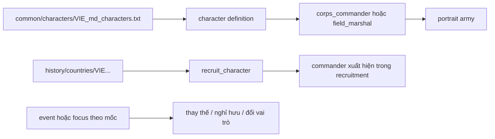

# Hệ thống Chỉ huy Tướng lĩnh, Nhân vật & Lực lượng Đặc biệt — Millennium Dawn

> **Tài liệu tổng hợp nghiên cứu hệ thống chỉ huy & binh chủng đặc biệt (08/10/2026)**  
> Hợp nhất 4 tài liệu phân mảnh về tướng lĩnh, characters và đặc công/lính dù/HQĐB.

## Mục lục
1. [Phần 1: Nghiên cứu Tướng lĩnh QĐND Việt Nam và Hệ thống Commander trong MD](#phần-1-nghiên-cứu-tướng-lĩnh-qđnd-việt-nam-và-hệ-thống-commander-trong-md)
2. [Phần 2: Niên biểu & Mốc xuất hiện Commander VIE](#phần-2-niên-biểu--mốc-xuất-hiện-commander-vie)
3. [Phần 3: Schema Character và Roster VIE trong Millennium Dawn](#phần-3-schema-character-và-roster-vie-trong-millennium-dawn)
4. [Phần 4: Lực lượng Đặc biệt — Đánh giá & Kế hoạch](#phần-4-lực-lượng-đặc-biệt-đặc-công--lính-dù--hq-đánh-bộ--đánh-giá--kế-hoạch)

---
## Phần 1: Nghiên cứu Tướng lĩnh QĐND Việt Nam và Hệ thống Commander trong MD

# Báo cáo nghiên cứu: Tướng lĩnh QĐND Việt Nam và hệ thống commander trong Millennium Dawn

**Ngày:** 01/10/2026  
**Phạm vi:** 2000 đến hiện tại; phục vụ thiết kế commander/field marshal cho quốc gia VIE trong submod Millennium Dawn.

> Báo cáo này đã kiểm tra trực tiếp roster VIE của Millennium Dawn trên GitHub. Roster Lục quân hiện được mở rộng lên khoảng 20 người: dùng roster upstream và thêm 7 commander cấp quân đoàn/quân khu/sư đoàn bằng ID riêng.

## 1. Kết luận điều hành

1. Trong giai đoạn 2000-nay, ba trục nhân sự có giá trị mô phỏng nhất là **Bộ trưởng Bộ Quốc phòng**, **Tổng Tham mưu trưởng** và **Chủ nhiệm Tổng cục Chính trị**. Không nên biến tất cả sĩ quan cấp cao thành nhân vật có mặt cùng lúc trên bản đồ.
2. Chuỗi Tổng Tham mưu trưởng có thể làm xương sống cho commander lịch sử: **Lê Văn Dũng -> Phùng Quang Thanh -> Nguyễn Khắc Nghiên -> Đỗ Bá Tỵ -> Phan Văn Giang -> Nguyễn Tân Cương**.
3. Chuỗi Bộ trưởng Quốc phòng: **Phạm Văn Trà -> Phùng Quang Thanh -> Ngô Xuân Lịch -> Phan Văn Giang**.
4. Mốc tổ chức quân đội quan trọng để gắn vào focus/event không chỉ là cá nhân: thành lập **Quân đoàn 12** năm 2023, **Quân đoàn 34** năm 2024 và hợp nhất Hậu cần - Kỹ thuật công bố ngày 05/02/2025.
5. Millennium Dawn upstream đã có `common/characters/VIE.txt` và history VIE đã `recruit_character` roster tương ứng. Submod chỉ thêm các commander mới bằng prefix riêng `VIE_army_`, không định nghĩa lại ID upstream.
6. `create_country_leader` trong repo là cơ chế lãnh đạo chính trị. Không dùng nó để mô phỏng tướng quân đội. Tướng phải đi qua character/commander system của MD/HOI4.

## 2. Cấu trúc chỉ huy cần mô phỏng

### 2.1. Bộ trưởng Bộ Quốc phòng

Đây là vị trí chính trị-quân sự cấp cao nhất trong hệ thống Bộ Quốc phòng, phù hợp nhất với country leader/minister-level representation, không phải general trực tiếp chỉ huy một quân đoàn trong gameplay.

| Giai đoạn | Bộ trưởng | Ý nghĩa thiết kế |
|---|---|---|
| 2000-2006 | Phạm Văn Trà | Giai đoạn chuyển tiếp đầu thế kỷ, duy trì hệ thống tổ chức và hiện đại hóa nền tảng |
| 2006-2016 | Phùng Quang Thanh | Cầu nối trực tiếp với chức Tổng Tham mưu trưởng; phù hợp nhân vật có cả vai trò chính trị và quân sự |
| 2016-2021 | Ngô Xuân Lịch | Gắn với Tổng cục Chính trị và quản trị chính trị-quân đội |
| 2021-nay | Phan Văn Giang | Bộ trưởng hiện tại; trước đó là Tổng Tham mưu trưởng, phù hợp chuỗi chuyển vai trò |

### 2.2. Tổng Tham mưu trưởng

Đây là tuyến commander quan trọng nhất để đưa vào gameplay vì chức vụ gắn với chỉ huy, tham mưu chiến lược và sẵn sàng chiến đấu.

| Thời gian gần đúng | Tổng Tham mưu trưởng | Ghi chú áp vào mod |
|---|---|---|
| Đầu giai đoạn 2000-05/2001 | Lê Văn Dũng | Chỉ cần đưa vào nếu muốn mô phỏng chính xác năm 2000-2001 |
| 05/2001-08/2006 | Phùng Quang Thanh | Commander/field marshal lịch sử của giai đoạn đầu |
| 08/2006-11/2010 | Nguyễn Khắc Nghiên | Gắn với chỉ huy chiến lược và tổ chức lực lượng |
| 11/2010-05/2016 | Đỗ Bá Tỵ | Đã có portrait trong repo: `Portrait_Do_Ba_Ty.dds` |
| 05/2016-06/2021 | Phan Văn Giang | Có thể dùng làm field marshal trước khi chuyển sang Bộ trưởng |
| 06/2021-nay | Nguyễn Tân Cương | Tổng Tham mưu trưởng hiện tại; nên là nhân vật active trong bookmark hiện đại |

### 2.3. Tổng cục Chính trị

Chủ nhiệm Tổng cục Chính trị không nên bị gộp máy móc vào field marshal. Vai trò này phù hợp với chief-of-army advisor, national spirit hoặc modifier về tổ chức, chính trị và ổn định quân đội.

Các nhân vật cần theo dõi trong giai đoạn này:

- Lê Văn Dũng: sau thời kỳ Tổng Tham mưu trưởng chuyển sang vai trò chính trị cấp cao trong quân đội.
- Ngô Xuân Lịch: Chủ nhiệm Tổng cục Chính trị trước khi làm Bộ trưởng.
- Lương Cường: giữ vai trò Chủ nhiệm Tổng cục Chính trị trong giai đoạn 2016-2024, sau đó chuyển sang vị trí chính trị nhà nước.
- Nguyễn Trọng Nghĩa: tên đã có trong danh sách character reference của repo; cần xác minh đúng thời điểm và chức vụ trước khi gán trait.

## 3. Các tướng/nhân vật quân sự đang được repo dự kiến

Bản reference `tools/audit/md_ref/VIE_country.txt` gọi `recruit_character` cho 19 ID:

`VIE_Nguyen_Chi_Vinh`, `VIE_Ngo_Xuan_Lich`, `VIE_Phi_Quoc_Tuan`, `VIE_Nguyen_Quang_Dam`, `VIE_Nguyen_Tan_Cuong`, `VIE_Nguyen_Trong_Nghia`, `VIE_Pham_Hoai_Nam`, `VIE_Pham_Kim_Hau`, `VIE_Pham_Van_Hung`, `VIE_Phan_Van_Giang`, `VIE_Tran_Don`, `VIE_Tran_Quang_Phuong`, `VIE_Tran_Viet_Khoa`, `VIE_Vo_Minh_Luong`, `VIE_Vo_Trong_Viet`, `VIE_Le_Xuan_Duy`, `VIE_Hoang_Xuan_Chien`, `VIE_Dinh_Gia_That`, `VIE_Be_Xuan_Truong`.

### Phân loại dùng cho bước tiếp theo

| Nhóm | Nhân vật nên ưu tiên | Cách dùng |
|---|---|---|
| Chỉ huy chiến lược | Phan Văn Giang, Nguyễn Tân Cương, Đỗ Bá Tỵ, Phùng Quang Thanh | Field marshal hoặc corps commander tùy cấp độ bookmark |
| Quản trị quốc phòng | Ngô Xuân Lịch, Nguyễn Chi Vịnh, Hoàng Xuân Chiến, Võ Minh Lương, Phạm Hoài Nam | Chief-of-army / advisor / commander theo hồ sơ xác minh |
| Hải quân | Phạm Hoài Nam, Nguyễn Quang Đạm, Phạm Kim Hậu | Naval commander; cần xác minh chức vụ và thời gian từng người |
| Chính trị-quân đội | Nguyễn Trọng Nghĩa, Trần Quang Phương, Bế Xuân Trường | Political advisor hoặc chief-of-army, không tự động gán field marshal |
| Chỉ huy quân khu/binh chủng | Trần Đơn, Võ Trọng Việt, Lê Xuân Duy, Đinh Gia Thất, Trần Việt Khoa | Corps commander nếu có hồ sơ chức vụ phù hợp |
| Chưa đủ dữ kiện trong repo | Phi Quốc Tuấn, Nguyễn Quang Đạm, Phạm Kim Hậu, Phạm Văn Hùng và một số ID khác | Không gán trait mạnh trước khi xác minh chức vụ, quân chủng và thời gian |

> Bảng trên là phân loại thiết kế, không phải khẳng định tất cả chức danh. Các tên chưa có hồ sơ nguồn riêng phải được kiểm tra qua Bộ Quốc phòng, QĐND, TTXVN hoặc hồ sơ chính thức trước khi ghi vào localization.

## 3.1. Lớp chỉ huy thấp hơn: quân đoàn, quân khu, sư đoàn và lữ đoàn

### Quân đoàn 12

| Chức vụ | Nhân vật | Mốc dùng trong mod |
|---|---|---|
| Tư lệnh | Trung tướng Lê Xuân Thuân | Từ 24/04/2025; commander cấp quân đoàn trong bookmark hiện đại |
| Chính ủy | Thiếu tướng Trần Đại Thắng | Political/organization advisor hoặc chính ủy cấp quân đoàn |
| Phó tư lệnh kiêm Tham mưu trưởng | Thiếu tướng Nguyễn Thành Phố | Planning/logistics commander phụ |
| Giai đoạn đầu thành lập | Thiếu tướng Trương Mạnh Dũng | Có thể dùng cho event 2023-2025 nếu mô phỏng quá trình thành lập |

Các đơn vị trực thuộc phù hợp để làm scope/commander gồm Sư đoàn 308, 312, 325, 390; Lữ đoàn Tăng - Thiết giáp 203; Lữ đoàn Pháo binh 164 và 368; Lữ đoàn Phòng không 241 và 673; Lữ đoàn Công binh 299; Trung đoàn Thông tin 140. Đây là danh sách tổ chức, chưa phải roster commander từng đơn vị.

### Quân đoàn 34

| Chức vụ | Nhân vật | Mốc dùng trong mod |
|---|---|---|
| Tư lệnh | Trung tướng Đào Tuấn Anh | Từ 24/04/2025; commander cấp quân đoàn hiện đại |
| Chính ủy | Trung tướng Lê Minh Quang | Political/organization advisor |
| Phó tư lệnh kiêm Tham mưu trưởng | Thiếu tướng Trần Công Đức | Planning/coordination commander phụ |
| Chỉ huy giai đoạn công bố thành lập | Thiếu tướng Nguyễn Bá Lực | Giữ trong event 12/2024 như tư lệnh ban đầu được công bố tại lễ thành lập |

Các đơn vị nổi bật gồm Sư đoàn 9, 10, 31, 320; Lữ đoàn Pháo binh 40 và 434; Lữ đoàn Phòng không 71 và 234; Lữ đoàn Tăng 273; Lữ đoàn Công binh 7; Trung đoàn Thông tin 29. Chưa gán commander cấp dưới nếu chưa có mốc bổ nhiệm rõ.

### Quân khu 7

Quân khu là cấp phù hợp với field marshal/army-group commander hơn là commander của một division cụ thể.

| Chức vụ | Nhân vật | Khoảng thời gian/ghi chú |
|---|---|---|
| Tư lệnh hiện nay | Trung tướng Lê Xuân Thế | Từ 28/06/2025 |
| Chính ủy hiện nay | Trung tướng Trần Vinh Ngọc | Nhiệm kỳ hiện tại |
| Phó tư lệnh kiêm Tham mưu trưởng | Thiếu tướng Lê Xuân Bình | Từ 2025 |
| Tư lệnh giai đoạn 2011-2015 | Trần Đơn | Sau đó là Thứ trưởng Bộ Quốc phòng; ID đã có trong repo |
| Tham mưu trưởng 2011-10/2015 | Võ Minh Lương | Sau đó là Thứ trưởng; ID đã có trong repo |
| Tư lệnh giai đoạn 2004-2009 | Lê Mạnh | Cần bổ sung portrait/character nếu mô phỏng đầy đủ từ năm 2000 |

Các đơn vị phù hợp để mở rộng roster gồm Sư đoàn 5, 7, 302, 309; Lữ đoàn Pháo binh 75; Lữ đoàn Phòng không 77; Lữ đoàn Công binh 25 và 550; Lữ đoàn Tăng - Thiết giáp 26; Lữ đoàn Thông tin 23. Bản đầu chỉ nên đưa tư lệnh quân khu vào gameplay; commander cấp sư đoàn/lữ đoàn nên được tuyển theo event hoặc decision riêng.

### Quy tắc nghiên cứu cấp sư đoàn/lữ đoàn

Ở cấp thấp hơn, một bài báo thường chỉ ghi “tư lệnh đơn vị” tại thời điểm bài viết, không cung cấp đầy đủ lịch sử thay đổi. Mỗi hồ sơ cần lưu bốn trường:

| Trường | Ví dụ |
|---|---|
| Đơn vị | Sư đoàn 308 / Lữ đoàn 203 |
| Chức vụ | Tư lệnh, Chính ủy, Tham mưu trưởng |
| Thời điểm hiệu lực | 2022-2024, không suy ra chỉ từ ngày bài đăng |
| Nguồn | Quyết định bổ nhiệm hoặc bài QĐND/Quân khu |

Không dùng cấp hàm để suy ra chức vụ. Hai thiếu tướng cùng xuất hiện trong một bài có thể là tư lệnh, chính ủy, phó tư lệnh hoặc cán bộ cơ quan.

### Mô hình hóa trong HOI4

- **Quân khu:** field marshal hoặc army-group commander; trait thiên về defense, planning, logistics.
- **Quân đoàn:** corps commander; trait thiên về planning, attack/defense theo hồ sơ.
- **Sư đoàn:** chỉ đưa vào nếu game có division commander; nếu không, đại diện bằng corps commander của đội hình chủ lực.
- **Lữ đoàn/trung đoàn:** không tạo commander quốc gia riêng; dùng event/decision, unit name và modifier tổ chức.
- **Chính ủy:** ưu tiên advisor/character chính trị, không biến thành commander chiến đấu chỉ vì là tướng.

Roster cấp dưới ưu tiên cho bản đầu: Lê Xuân Thuân, Đào Tuấn Anh, Lê Xuân Thế, Trần Đơn, Võ Minh Lương, Nguyễn Bá Lực và Nguyễn Thành Phố. Các tên khác giữ trong bảng nghiên cứu cho tới khi có nguồn xác nhận chức vụ và mốc thời gian.

## 3.2. Roster thực tế trong Millennium Dawn GitHub

Kiểm tra `MillenniumDawn/Millennium-Dawn/common/characters/VIE.txt` cho thấy roster upstream gồm:

| ID | Vai trò trong MD |
|---|---|
| `VIE_Nguyen_Chi_Vinh` | `field_marshal` |
| `VIE_Ngo_Xuan_Lich` | `corps_commander` |
| `VIE_Phi_Quoc_Tuan` | `corps_commander` |
| `VIE_Hyunh_Chien_Thang` | `corps_commander`, nhưng không nằm trong danh sách recruit history hiện tại |
| `VIE_Nguyen_Quang_Dam` | advisor `army_chief` |
| `VIE_Nguyen_Tan_Cuong` | advisor `army_chief` |
| `VIE_Nguyen_Trong_Nghia` | advisor `high_command` |
| `VIE_Pham_Hoai_Nam` | advisor `navy_chief` |
| `VIE_Pham_Kim_Hau` | advisor `navy_chief` |
| `VIE_Pham_Van_Hung` | advisor `high_command` |
| `VIE_Phan_Van_Giang` | advisor `high_command` |
| `VIE_Tran_Don` | advisor `high_command` |
| `VIE_Tran_Quang_Phuong` | advisor `air_chief` |
| `VIE_Tran_Viet_Khoa` | advisor `air_chief` |
| `VIE_Vo_Minh_Luong` | advisor `high_command`, ledger `air` |
| `VIE_Vo_Trong_Viet` | advisor `high_command`, ledger `air` |
| `VIE_Le_Xuan_Duy` | advisor `high_command` |
| `VIE_Hoang_Xuan_Chien` | advisor `army_chief` |
| `VIE_Dinh_Gia_That` | advisor `navy_chief` và `navy_leader` |
| `VIE_Be_Xuan_Truong` | advisor `high_command` |

History VIE upstream tuyển 19 ID, bỏ `VIE_Hyunh_Chien_Thang` dù character vẫn được định nghĩa. Đây là điểm cần nghiên cứu thêm, nhưng không nên tự động tuyển thêm nếu chưa xác định lý do lịch sử/thiết kế.

Upstream dùng đường dẫn portrait trực tiếp như `gfx/leaders/VIE/Portrait_Phan_Van_Giang.dds`, không cần tạo sprite GFX riêng cho character. Schema cũng dùng trait MD chuyên biệt như `army_chief_logistics_2`, `army_armored_1`, `navy_chief_maneuver_2`, `navy_career_officer`.

## 4. Mốc tổ chức nên gắn với gameplay

### 4.1. Quân đoàn 12

- Công bố thành lập ngày 02/12/2023.
- Hình thành trên cơ sở sáp nhập Quân đoàn 1 và Quân đoàn 2.
- Vai trò: quân đoàn chủ lực cơ động chiến lược, tổ chức theo hướng tinh, gọn, mạnh.
- Thiết kế đề xuất: event nền hoặc focus `VIE_to_chuc_quan_doan`, cho modifier tổ chức/cơ động và mở character commander cấp quân đoàn.

### 4.2. Quân đoàn 34

- Công bố thành lập ngày 15/12/2024.
- Hình thành trên cơ sở sáp nhập Quân đoàn 3 và Quân đoàn 4.
- Thiếu tướng Nguyễn Bá Lực được nêu là Tư lệnh tại lễ công bố; từ 24/04/2025, nguồn cập nhật ghi Trung tướng Đào Tuấn Anh giữ chức Tư lệnh.
- Thiết kế đề xuất: event năm 2024 cập nhật commander của quân đoàn và tăng hiệu quả tổ chức lực lượng, không tạo thêm một field marshal quốc gia.

### 4.3. Hợp nhất Hậu cần - Kỹ thuật

- Quyết định 366/QĐ-BQP ngày 24/01/2025.
- Lễ công bố hợp nhất ngày 05/02/2025.
- Đây là mốc phù hợp cho advisor/character phụ trách hậu cần-kỹ thuật, không phải commander chiến đấu.
- Báo QĐND nêu Trung tướng Trần Minh Đức là Chủ nhiệm Tổng cục Hậu cần - Kỹ thuật trong bài năm 2025; cần ghi nguồn và thời điểm rõ nếu đưa vào mod.

## 5. Cơ chế character/commander trong HOI4 và MD

### 5.1. Ba khái niệm cần tách

1. **Country leader:** lãnh đạo chính trị của quốc gia. Repo hiện dùng `create_country_leader` trong `common/scripted_effects/VIE_md_effects.txt` và `VIE_political_leaders.txt`.
2. **Character:** hồ sơ nhân vật có thể được tuyển vào quốc gia. History gọi bằng `recruit_character = VIE_...`.
3. **Commander:** vai trò quân sự của character, thường là `corps_commander` hoặc `field_marshal`, có skill và commander traits. Đây mới là nơi cần áp các tướng quân đội.

### 5.2. Luồng dữ liệu đề xuất



Luồng triển khai nên là:

1. Định nghĩa character trong `common/characters/` theo schema của bản Millennium Dawn đang cài.
2. Gắn `portraits = { army = ... }` hoặc trường portrait tương ứng với schema MD.
3. Gắn block `corps_commander` hoặc `field_marshal` với skill và traits.
4. Gọi `recruit_character` trong history quốc gia VIE.
5. Dùng event theo mốc để thêm, retire hoặc thay commander nếu muốn mô phỏng lịch sử.
6. Kiểm tra trong game và `error.log`; không suy ra schema chỉ từ bản reference của repo.

### 5.3. Skill và trait nên dùng thận trọng

Không nên gán skill theo cấp hàm. Skill nên phản ánh vai trò gameplay:

- `skill`: năng lực tổng hợp.
- `attack_skill`: phù hợp người có hồ sơ chỉ huy tác chiến.
- `defense_skill`: phù hợp chỉ huy phòng thủ/quân khu.
- `planning_skill`: phù hợp tham mưu và tổ chức chiến dịch.
- `logistics_skill`: phù hợp hậu cần-kỹ thuật.

Đề xuất thang khởi điểm bảo thủ:

| Vai trò | Skill tổng | Phân bổ gợi ý |
|---|---:|---|
| Tổng Tham mưu trưởng | 3-4 | planning 3-4, logistics 2-3, attack/defense 2-3 |
| Tư lệnh quân đoàn | 2-3 | attack hoặc defense 2-3, planning 2 |
| Tư lệnh hải quân | 2-3 | attack/defense 2-3, planning 2 |
| Hậu cần-kỹ thuật | Không ưu tiên commander | advisor/logistics trait |
| Chủ nhiệm chính trị | Không ưu tiên commander | stability, organization, army experience advisor |

Không dùng trait “offensive”/“logistics” chỉ vì một người giữ chức vụ cao; cần gắn với hồ sơ và vai trò lịch sử.

## 6. Khoảng trống kỹ thuật hiện tại của repo

### Đã có

- Millennium Dawn GitHub: `common/characters/VIE.txt` định nghĩa roster VIE.
- Millennium Dawn GitHub: `history/countries/VIE - Vietnam.txt` tuyển roster bằng `recruit_character`.
- Repo submod có bản reference tương ứng trong `tools/audit/md_ref/VIE_country.txt` và `VIE_Vietnam.txt`.
- Submod bổ sung `common/characters/VIE_md_army_expansion.txt` với 7 commander Lục quân mới.
- 7 commander mới (cộng Trương Mạnh Dũng, tổng 8) được tuyển bằng event `vie_army_commanders.1` từ `date > 2025.12.31`, không còn tuyển lúc khởi động. Xem `VIE_land_forces_implementation_plan_v2.md`.
- Localization mới nằm trong `localisation/english/VIE_army_commanders_l_english.yml`.
- Portrait VIE cục bộ trong `gfx/leaders/VIE/`: các file có sẵn (Trà, Thanh, Tỵ, Đỗ Bá Tỵ, 7 commander Quân đoàn 12/34...) và 13 ảnh placeholder sinh bằng `tools/build_vie_placeholder_portraits.py`, cùng các portrait VIE còn lại do base Millennium Dawn cung cấp khi game load.
- `recruit_character` list trong `tools/audit/md_ref/VIE_country.txt` và `VIE_Vietnam.txt`.
- Country leader creation và chuyển giao Tổng Bí thư trong `common/scripted_effects/VIE_md_effects.txt`.
- Báo cáo quân sự đã đề xuất mô hình cải cách chỉ huy, quân đoàn 12/34 và hệ thống “tinh, gọn, mạnh”.

### Chưa có / cần làm

- Các portrait placeholder (silhouette trung tính, không phải chân dung thật) cần thay bằng ảnh thật nếu có; ghi đè cùng tên file và bỏ id khỏi `PLACEHOLDERS` trong script.
- Roster đã có hai giai đoạn (2000-2014 và 2015-nay) cộng một mốc phụ 2026: xem `VIE_land_forces_implementation_plan_v2.md`. Cơ chế đổi roster chưa được test trong game.
- Cần kiểm tra version base MD cài thực tế có khớp commit GitHub đã kiểm tra hay không.
- Cần test trong game để xác nhận toàn bộ portrait base và các advisor trait được nạp.

## 7. Lộ trình áp dụng vào mod

### Bước 1: Roster Lục quân khoảng 20 người

Roster nền dùng các character Lục quân upstream; bảy người bổ sung cấp thấp hơn đã được thêm bằng ID riêng. Tổng số khoảng 20 người, không duplicate ID MD.

### Bước 2: Mapping vai trò upstream

- Nguyễn Chí Vịnh: `field_marshal`.
- Ngô Xuân Lịch, Phi Quốc Tuấn, Huỳnh Chiến Thắng: `corps_commander`.
- Đinh Gia Thật: `navy_leader` và `navy_chief`.
- Nguyễn Tân Cương, Hoàng Xuân Chiến: `army_chief`.
- Phạm Hoài Nam, Phạm Kim Hậu: `navy_chief`.
- Nguyễn Quang Đạm: `army_chief`.
- Nguyễn Trọng Nghĩa, Phạm Văn Hùng, Phan Văn Giang, Trần Đơn, Võ Minh Lương, Võ Trọng Việt, Lê Xuân Duy, Trần Quang Phương, Trần Việt Khoa, Bế Xuân Trường: advisor/high command theo `slot` trong file MD.

### Bước 3: Character definitions

Đã kiểm tra schema upstream: `characters -> portraits -> field_marshal/corps_commander/navy_leader/advisor`. File mở rộng chỉ dùng ID `VIE_army_*`; không override ID trong `VIE.txt` của Millennium Dawn.

### Bước 4: Portrait và localization

- Dùng portrait do base MD cung cấp; submod chỉ bổ sung ảnh khi base thiếu hoặc ảnh sai.
- Không tạo lại localization tên nếu base MD đã có key tương ứng.
- Không dùng tên có dấu trong ID nội bộ; localization hiển thị tên tiếng Việt có dấu.

### Bước 5: Việc còn lại: nối lịch sử và mốc thời gian

Bookmark năm 2000 nên có Lê Văn Dũng hoặc Phùng Quang Thanh tùy mốc chính xác của file history. Event chuyển vai trò:

- 2001: Phùng Quang Thanh lên Tổng Tham mưu trưởng.
- 2006: Nguyễn Khắc Nghiên.
- 2010: Đỗ Bá Tỵ.
- 2016: Phan Văn Giang.
- 2021: Nguyễn Tân Cương; Phan Văn Giang chuyển sang Bộ trưởng.
- 2023/2024: cập nhật commander quân đoàn 12/34 nếu hệ mod mô phỏng cấp quân đoàn.

### Bước 6: Test

1. Mở bookmark 2000, kiểm tra recruitment panel.
2. Chuyển ngày qua từng mốc thay tướng.
3. Kiểm tra không có hai commander cùng chức vụ hoặc character bị recruit lặp.
4. Kiểm tra portrait không thiếu và không có lỗi localization.
5. Kiểm tra commander trait có tác động đúng quân đoàn/quân chủng.
6. Đọc `error.log` sau khi vào game và sau khi tuyển tướng.

## 8. Nguồn tham khảo

- [Chief of the General Staff of Vietnam](https://en.wikipedia.org/wiki/Chief_of_the_General_Staff_(Vietnam)) — chuỗi Tổng Tham mưu trưởng và mốc Nguyễn Tân Cương.
- [Minister of Defence of Vietnam](https://en.wikipedia.org/wiki/Minister_of_Defence_(Vietnam)) — chuỗi Bộ trưởng và cấu trúc chức vụ.
- [Báo Lào Cai: thành lập Quân đoàn 34](https://baolaocai.vn/dai-tuong-phan-van-giang-du-le-cong-bo-quyet-dinh-thanh-lap-quan-doan-34-post394811.html) — mốc 15/12/2024, Nguyễn Bá Lực, Nguyễn Tân Cương, Võ Minh Lương.
- [Quân đoàn 12](https://vi.wikipedia.org/wiki/Qu%C3%A2n_%C4%91o%C3%A0n_12_(Vi%E1%BB%87t_Nam)) — Lê Xuân Thuân, Trần Đại Thắng, Nguyễn Thành Phố và hệ thống sư đoàn/lữ đoàn trực thuộc.
- [Quân đoàn 34](https://vi.wikipedia.org/wiki/Qu%C3%A2n_%C4%91o%C3%A0n_34_(Vi%E1%BB%87t_Nam)) — Đào Tuấn Anh, Lê Minh Quang, Trần Công Đức và hệ thống đơn vị trực thuộc.
- [Quân khu 7](https://vi.wikipedia.org/wiki/Qu%C3%A2n_khu_7,_Qu%C3%A2n_%C4%91%E1%BB%99i_nh%C3%A2n_d%C3%A2n_Vi%E1%BB%87t_Nam) — chuỗi chỉ huy quân khu, tham mưu trưởng và danh sách sư đoàn/lữ đoàn.
- [QĐND: bàn giao chức vụ Tư lệnh Quân đoàn 12](https://www.qdnd.vn/quoc-phong-an-ninh/tin-tuc/ban-giao-chuc-vu-tu-lenh-quan-doan-12-827158) — mốc chuyển giao năm 2025.
- [Báo Quân đội nhân dân: tinh gọn Hậu cần - Kỹ thuật](https://www.qdnd.vn/quoc-phong-an-ninh/xay-dung-quan-doi/tinh-gon-to-chuc-bien-che-thuc-hien-thang-loi-nhiem-vu-cong-tac-hau-can-ky-thuat-trong-tinh-hinh-moi-815137) — Quyết định 366/QĐ-BQP và mốc 05/02/2025.
- [Báo cáo Lục quân VIE — Trục 1, 2, 3](Báo cáo Lục quân VIE — Trục 1, 2, 3.md) — nền tổ chức, Quân đoàn 12/34 và đề xuất cải cách chỉ huy.
- [VIE_military_branch_research_report.md](VIE_military_branch_research_report.md) — nền hiện đại hóa và khoảng trống thiết kế quân sự.
- [tools/audit/md_ref/VIE_country.txt](tools/audit/md_ref/VIE_country.txt) — danh sách `recruit_character` reference hiện có.
- [common/scripted_effects/VIE_md_effects.txt](common/scripted_effects/VIE_md_effects.txt) — cơ chế country leader hiện tại.

## 9. Kết luận triển khai

Bước kế tiếp đúng không phải là thêm hàng loạt tướng ngay, mà là **lấy schema character đang chạy của Millennium Dawn, dựng 6-8 nhân vật chắc dữ kiện, nối portrait hiện có, rồi test một bookmark từ 2000 đến 2021**. Sau khi luồng này chạy sạch, mới mở rộng roster theo quân chủng, quân khu và Quân đoàn 12/34.

---

## Phần 2: Niên biểu & Mốc xuất hiện Commander VIE

# Báo cáo nghiên cứu mốc xuất hiện commander VIE

> **Đã lỗi thời một phần.** Mốc 2005 trong báo cáo này đã bị thay bằng hai giai đoạn (2000-2014 và 2015-nay) trong `VIE_land_forces_roster_rebuild.md` và `VIE_land_forces_implementation_plan_v2.md`. Đoạn nói Nguyễn Chí Vịnh có "căn cứ đủ mạnh" ở 2000 cũng không còn đúng: năm 1998 ông mới là Phó Tổng cục trưởng Tổng cục II, Tổng cục trưởng từ 2002. Giữ file này để tham khảo bảng bằng chứng ở mục 3.

**Ngày:** 01/10/2026  
**Phạm vi:** Millennium Dawn VIE, bookmark 2000 và các mốc 2005, 2010, 2015, 2021, 2023-2025.  
**Mục đích:** xác định character nào có thể xuất hiện đầu game và character nào phải tuyển theo mốc lịch sử.

## 1. Kết luận điều hành

Không nên dùng thẳng phân bổ `12 người năm 2000 / 6 người năm 2005 / 7 người năm 2010` như một kết luận lịch sử. Có ba vấn đề:

1. Millennium Dawn upstream hiện tuyển **19 character VIE** trong history 2000.
2. Submod có thêm **7 character `VIE_army_*`**, tổng cộng **26 ID**.
3. Phân bổ 12 + 6 + 7 chỉ có 25 người và không khớp tổng roster 26; hơn nữa 7 commander mở rộng của submod gắn với Quân đoàn 12/34, chỉ xuất hiện từ 2023-2025, không thể hợp lý hóa thành roster năm 2010.

Kết luận bảo thủ:

- **Có thể giữ đầu game 2000:** chỉ những người có vai trò cấp cao đã tồn tại trước hoặc quanh năm 2000, hoặc được xác nhận là sĩ quan cao cấp nhưng chưa có ngày bổ nhiệm chính xác.
- **Mốc 2005/2010:** chỉ dùng cho người có bằng chứng họ đã giữ chức vụ chỉ huy trước hoặc trong giai đoạn đó. Không dùng năm giữ chức hiện đại để suy ngược.
- **Mốc 2015/2016/2021:** phù hợp hơn cho nhiều advisor/high command upstream hiện đang bị history MD tuyển từ 2000.
- **Mốc 2023-2025:** bắt buộc cho 7 commander submod vì họ gắn với Quân đoàn 12, Quân đoàn 34 và Quân khu 7 hiện đại.

## 2. Nguồn và giới hạn dữ liệu

### Nguồn trong repository

- `tools/audit/md_ref/VIE_country.txt`: history MD tuyển 19 character ngay trong block `2000.1.1`.
- `VIE_generals_and_commander_system_research_report.md`: chuỗi Tổng Tham mưu trưởng, Bộ trưởng Quốc phòng, roster upstream và các mốc Quân đoàn 12/34.
- `VIE_md_character_schema_and_roster.md`: schema character MD, danh sách vai trò upstream và xác nhận history upstream tuyển 19 ID.

### Nguồn công khai đã đối chiếu

- [Chief of the General Staff of Vietnam](https://en.wikipedia.org/wiki/Chief_of_the_General_Staff_(Vietnam)): Lê Văn Dũng 1998-2001, Phùng Quang Thanh 2001-2006, Nguyễn Khắc Nghiên 2006-2010, Đỗ Bá Tỵ 2010-2016, Phan Văn Giang 2016-2021, Nguyễn Tân Cương từ 2021.
- [Minister of Defence of Vietnam](https://en.wikipedia.org/wiki/Minister_of_Defence_(Vietnam)): xác nhận Phan Văn Giang là Bộ trưởng từ 2021 và chuỗi Bộ trưởng được dùng để đối chiếu vai trò chính trị-quân sự.
- [QĐND: Bàn giao chức vụ Tư lệnh Quân đoàn 12](https://www.qdnd.vn/quoc-phong-an-ninh/tin-tuc/ban-giao-chuc-vu-tu-lenh-quan-doan-12-827158): Lê Xuân Thuân nhận chức Tư lệnh Quân đoàn 12 năm 2025.
- [Chính phủ: bổ nhiệm Lê Xuân Thế làm Tư lệnh Quân khu 7](https://xaydungchinhsach.chinhphu.vn/thu-tuong-bo-nhiem-tan-thu-truong-bo-quoc-phong-tu-lenh-quan-khu-7-11925070922253096.htm): Lê Xuân Thế nhận chức Tư lệnh Quân khu 7 năm 2025.
- [VietNamNet: Nguyễn Bá Lực](https://vietnamnet.vn/tu-lenh-quan-doan-34-giu-chuc-pho-tong-tham-muu-truong-qdnd-viet-nam-2394744.html): Nguyễn Bá Lực là Tư lệnh Quân đoàn 34 trước khi chuyển làm Phó Tổng Tham mưu trưởng năm 2025.
- [TTXVN: hồ sơ Đào Tuấn Anh](https://nvsk.vnanet.vn/ho-so/dao-tuan-anh-3-181955.vna): Đào Tuấn Anh là Tư lệnh Quân đoàn 34 trong giai đoạn hiện đại.
- [QĐND: Trần Công Đức](https://www.qdnd.vn/quoc-phong-an-ninh/tin-tuc/quan-doan-34-hoan-thanh-toan-dien-nhiem-vu-quy-i-nam-2026-1034371): Trần Công Đức là Phó tư lệnh kiêm Tham mưu trưởng Quân đoàn 34 năm 2026.

Các nguồn trên xác nhận chắc các mốc hiện đại. Với nhiều tên upstream khác, repo chỉ có role gameplay mà không có hồ sơ ngày bổ nhiệm; các kết luận bên dưới vì vậy được đánh dấu mức tin cậy.

## 3. Timeline đã xác minh

| Nhân vật / ID | Bằng chứng lịch sử | Mốc gameplay đề xuất | Độ tin cậy |
|---|---|---:|---|
| Nguyễn Chí Vịnh / `VIE_Nguyen_Chi_Vinh` | Tướng cấp cao, gắn với Tổng cục Tình báo Quốc phòng trong giai đoạn trước 2010; có thể đại diện lớp chỉ huy chiến lược đầu thế kỷ | 2000 | Trung bình-khá |
| Phùng Quang Thanh | Tổng Tham mưu trưởng 05/2001-08/2006; không phải ID commander mở rộng của submod nhưng là chuẩn đối chiếu lịch sử | 2001 | Cao |
| Nguyễn Khắc Nghiên | Tổng Tham mưu trưởng 08/2006-11/2010; không phải ID recruit hiện tại | 2006 | Cao |
| Đỗ Bá Tỵ | Tổng Tham mưu trưởng 11/2010-05/2016; portrait đã có trong repo, nhưng chưa được thêm thành character mới trong submod | 2010 | Cao |
| Phan Văn Giang / `VIE_Phan_Van_Giang` | Tổng Tham mưu trưởng 05/2016-06/2021, Bộ trưởng từ 2021 | 2016 | Cao |
| Nguyễn Tân Cương / `VIE_Nguyen_Tan_Cuong` | Tổng Tham mưu trưởng từ 2021 | 2021 | Cao |
| Bế Xuân Trường / `VIE_Be_Xuan_Truong` | Thuộc lớp lãnh đạo quốc phòng hiện đại; report đặt trong nhóm chính trị-quân đội, không có bằng chứng đủ để đưa về 2000 | 2015-2016 | Trung bình |
| Lê Xuân Thuân / `VIE_army_le_xuan_thuan` | Tư lệnh Quân đoàn 12 từ 24/04/2025 | 2023-2025; không trước 2023 | Cao |
| Trần Đại Thắng / `VIE_army_tran_dai_thang` | Chính ủy Quân đoàn 12 trong giai đoạn Quân đoàn 12 hiện đại | 2023-2025; không trước 2023 | Cao |
| Nguyễn Thành Phố / `VIE_army_nguyen_thanh_pho` | Phó tư lệnh kiêm Tham mưu trưởng Quân đoàn 12 trong nguồn QĐND năm 2026 | 2023-2025; không trước 2023 | Cao |
| Đào Tuấn Anh / `VIE_army_dao_tuan_anh` | Tư lệnh Quân đoàn 34 trong giai đoạn hiện đại | 2024-2025; không trước 2023 | Cao |
| Nguyễn Bá Lực / `VIE_army_nguyen_ba_luc` | Tư lệnh Quân đoàn 34 tại giai đoạn thành lập, chuyển công tác năm 2025 | 2024-2025; không trước 2023 | Cao |
| Trần Công Đức / `VIE_army_tran_cong_duc` | Phó tư lệnh kiêm Tham mưu trưởng Quân đoàn 34 năm 2026 | 2024-2025; không trước 2023 | Cao |
| Lê Xuân Thế / `VIE_army_le_xuan_the` | Tư lệnh Quân khu 7 từ 2025 | 2025; không trước 2023 | Cao |

## 4. Phân nhóm upstream 19 ID để phục vụ code

Đây là phân nhóm thiết kế bảo thủ, không phải khẳng định ngày bổ nhiệm chính thức cho mọi người.

### 4.1. Có thể xuất hiện ở bookmark 2000

Chỉ nên giữ một nhóm nhỏ có vai trò cấp cao hoặc có khả năng đã là sĩ quan cao cấp trước 2000:

- `VIE_Nguyen_Chi_Vinh`
- `VIE_Ngo_Xuan_Lich`
- `VIE_Phi_Quoc_Tuan`
- `VIE_Nguyen_Quang_Dam`
- `VIE_Pham_Kim_Hau`

Nhóm này vẫn cần kiểm tra thêm hồ sơ chức vụ cụ thể. Nếu yêu cầu lịch sử nghiêm ngặt, chỉ Nguyễn Chí Vịnh hiện có căn cứ đủ mạnh để giữ chắc ở 2000; bốn người còn lại nên dùng mốc 2005 fallback.

### 4.2. Có thể mở từ 2005, dùng fallback nếu thiếu ngày chính thức

- `VIE_Pham_Van_Hung`
- `VIE_Tran_Don`
- `VIE_Vo_Trong_Viet`
- `VIE_Le_Xuan_Duy`
- `VIE_Tran_Viet_Khoa`
- `VIE_Dinh_Gia_That`

Các ID này có role high command, quân khu, binh chủng hoặc hải quân trong MD nhưng report chưa có ngày bắt đầu đủ chắc. Mốc 2005 là fallback gameplay, không nên ghi là ngày lịch sử chính thức.

### 4.3. Nên trì hoãn đến 2015-2016

- `VIE_Phan_Van_Giang`: 2016 là mốc có căn cứ, không nên tuyển từ 2000.
- `VIE_Be_Xuan_Truong`: dùng 2015-2016 theo lớp lãnh đạo quốc phòng hiện đại.

### 4.4. Nên trì hoãn đến 2021

- `VIE_Nguyen_Tan_Cuong`: Tổng Tham mưu trưởng từ 2021.
- `VIE_Nguyen_Trong_Nghia`: vai trò chính trị-quân đội cấp cao thuộc giai đoạn hiện đại.
- `VIE_Pham_Hoai_Nam`: advisor/navy chief gắn với lớp lãnh đạo hải quân hiện đại.
- `VIE_Tran_Quang_Phuong`: advisor không quân/chính trị-quân đội, chưa có căn cứ đưa về 2000.
- `VIE_Vo_Minh_Luong`: vai trò cấp cao hiện đại; report gắn với giai đoạn sau 2020.
- `VIE_Hoang_Xuan_Chien`: advisor quân đội cấp cao hiện đại.

## 5. Đối chiếu với yêu cầu 12 / 6 / 7

Yêu cầu số lượng 12 + 6 + 7 chưa khớp roster hiện tại:

- upstream recruit history: 19 người;
- submod mở rộng: 7 người;
- tổng đang dùng: 26 người;
- 12 + 6 + 7 = 25 người.

Ngoài ra, 7 người mở rộng của submod có nguồn lịch sử gắn với Quân đoàn 12/34 và Quân khu 7 từ 2023-2025, nên không thể đặt họ vào năm 2010 nếu giữ tính lịch sử.

Phân bổ hợp lý hơn cho roster hiện tại là:

- 2000: 1 người chắc chắn, tối đa 5 người nếu chấp nhận suy luận bảo thủ;
- 2005: 6 người fallback;
- 2015-2016: 2 người;
- 2021: 6 người;
- 2023-2025: 7 người mở rộng.

Nếu bắt buộc phải có đúng 12 người đầu game, đó phải là **một quyết định balance/gameplay**, không nên ghi là kết luận lịch sử. Có thể tuyển 12 người đầu game nhưng cần gắn nhãn “roster đại diện sĩ quan đương nhiệm”, không phải “12 người đang giữ chức vụ tương ứng năm 2000”.

## 6. Khuyến nghị triển khai sau báo cáo

1. Giữ character definitions và portrait độc lập với recruitment timing.
2. Không retire/recruit cả roster upstream thành một nhóm duy nhất.
3. Tách event theo cohort 2005, 2016, 2021 và 2023.
4. Giữ Nguyễn Chí Vịnh ở history 2000 nếu muốn có một chỉ huy chiến lược đầu game.
5. Đưa Phan Văn Giang và Bế Xuân Trường vào event 2016.
6. Đưa Nguyễn Tân Cương, Nguyễn Trọng Nghĩa, Phạm Hoài Nam, Trần Quang Phương, Võ Minh Lương và Hoàng Xuân Chiến vào event 2021.
7. Giữ 7 commander submod ở event 2023 hoặc các event chi tiết 2024-2025.
8. Chỉ nâng bốn người hiện đang ở nhóm 2000 lên mức chắc chắn sau khi có hồ sơ chức vụ trước 2005 từ QĐND, Bộ Quốc phòng hoặc TTXVN.

## 7. Trạng thái code tại thời điểm lập báo cáo

Các event cohort tạm thời (2015/2016/2021/2023) đã được thay: còn một event đổi roster ngày 2015.1.1 (`vie_army_commanders.2`) và một event Quân đoàn 12/34 từ 2026 (`vie_army_commanders.1`). Chưa coi số 12/6/7 là dữ kiện lịch sử.

---

## Phần 3: Schema Character và Roster VIE trong Millennium Dawn

# Millennium Dawn: schema character và roster VIE đã có sẵn

**Ngày kiểm tra:** 01/10/2026  
**Nguồn chính:** `MillenniumDawn/Millennium-Dawn/common/characters/VIE.txt` và `history/countries/VIE - Vietnam.txt` trên GitHub.

## 1. Kết luận quan trọng

Millennium Dawn upstream **đã có character file VIE và đã recruit các nhân vật này trong history Việt Nam**. Submod không được tạo lại các ID `VIE_*` trùng với upstream.

Roster upstream hiện có:

- 1 `field_marshal`.
- 3 `corps_commander` được định nghĩa, trong đó 2 được recruit history và `VIE_Hyunh_Chien_Thang` hiện không nằm trong danh sách recruit.
- 1 `navy_leader`.
- Nhóm advisor cho `army_chief`, `navy_chief`, `air_chief` và `high_command`.
- History VIE tuyển 19 character.

## 2. Schema live của Millennium Dawn

File character dùng wrapper:

```txt
characters = {
	TAG_character_id = {
		name = "Displayed Name"
		portraits = {
			army = {
				small = "gfx/leaders/TAG/small/Portrait_small.dds"
				large = "gfx/leaders/TAG/Portrait.dds"
			}
		}
		field_marshal = {
			traits = { trait_name }
			skill = 3
			attack_skill = 3
			defense_skill = 3
			planning_skill = 3
			logistics_skill = 3
		}
	}
}
```

Role block hợp lệ trong MD gồm:

- `field_marshal`
- `corps_commander`
- `navy_leader`
- `advisor`

### Advisor schema

```txt
advisor = {
	slot = army_chief # army_chief / navy_chief / air_chief / high_command
	idea_token = character_token
	ledger = army # bắt buộc cho high_command; army / navy / air
	traits = {
		army_chief_logistics_2
	}
	cost = 100
	ai_will_do = {
		factor = 1
	}
}
```

### Commander schema

Lục quân dùng:

```txt
corps_commander = {
	traits = { infantry_leader }
	skill = 3
	attack_skill = 2
	defense_skill = 3
	planning_skill = 3
	logistics_skill = 2
}
```

Field marshal dùng cùng bốn skill chiến dịch. Hải quân dùng schema riêng:

```txt
navy_leader = {
	traits = { navy_career_officer chief_engineer naval_lineage }
	skill = 4
	attack_skill = 4
	defense_skill = 2
	maneuvering_skill = 3
	coordination_skill = 4
}
```

Không dùng `create_country_leader` cho commander. Đó là hệ lãnh đạo chính trị riêng.

## 3. Roster 8 nhân vật chắc dữ kiện để làm mẫu

Đây là **8 character đã tồn tại upstream**, không tạo lại ID.

| ID | Vai trò MD | Dữ liệu upstream đáng chú ý |
|---|---|---|
| `VIE_Nguyen_Chi_Vinh` | `field_marshal` | `trait_engineer`, `hill_fighter`, `jungle_rat`, `organizer`; skill 4, attack 3, defense 2, planning 3, logistics 5 |
| `VIE_Phi_Quoc_Tuan` | `corps_commander` | `old_guard`, `skilled_staffer`; skill 3, attack 2, defense 2, planning 4, logistics 2 |
| `VIE_Nguyen_Tan_Cuong` | `army_chief` | `army_chief_logistics_2`, cost 100 |
| `VIE_Phan_Van_Giang` | `high_command`, ledger army | `army_armored_1`, cost 100 |
| `VIE_Pham_Hoai_Nam` | `navy_chief`, ledger navy | `navy_chief_reform_2`, cost 150 |
| `VIE_Dinh_Gia_That` | `navy_chief` + `navy_leader` | Advisor `navy_chief_maneuver_2`; commander traits `navy_career_officer`, `chief_engineer`, `naval_lineage`; skill 4, attack 4, defense 2, maneuvering 3, coordination 4 |
| `VIE_Tran_Don` | `high_command`, ledger army | `army_infantry_3`, cost 125 |
| `VIE_Be_Xuan_Truong` | `high_command`, ledger army | `army_militia_2`, cost 100 |

Roster này phủ đủ bốn nhóm gameplay: chỉ huy chiến dịch, tham mưu lục quân, hải quân và high command.

## 4. Character upstream nhưng cần lưu ý

| ID | Tình trạng |
|---|---|
| `VIE_Ngo_Xuan_Lich` | Có `corps_commander`, được recruit history; cần đọc tiếp block đầy đủ nếu cân bằng trait/skill |
| `VIE_Hyunh_Chien_Thang` | Có `corps_commander`, nhưng không được recruit trong history VIE hiện tại |
| `VIE_Nguyen_Quang_Dam` | `army_chief`, reform trait |
| `VIE_Nguyen_Trong_Nghia` | `high_command`, army entrenchment |
| `VIE_Pham_Kim_Hau` | `navy_chief`, maneuver |
| `VIE_Pham_Van_Hung` | `high_command`, army regrouping |
| `VIE_Tran_Quang_Phuong` | `air_chief`, air reform |
| `VIE_Tran_Viet_Khoa` | `air_chief`, bomber interception |
| `VIE_Vo_Minh_Luong` | `high_command`, ledger air |
| `VIE_Vo_Trong_Viet` | `high_command`, ledger air |
| `VIE_Le_Xuan_Duy` | `high_command`, artillery |
| `VIE_Hoang_Xuan_Chien` | `army_chief`, drill |

> **Lưu ý về 4 character Không quân upstream:** `VIE_Tran_Quang_Phuong` và `VIE_Tran_Viet_Khoa` (slot `air_chief`), `VIE_Vo_Minh_Luong` và `VIE_Vo_Trong_Viet` (`high_command` ledger air) không có chức vụ nào ở Quân chủng Phòng không - Không quân trong hồ sơ công khai (tướng chính trị, tướng Lục quân hoặc Biên phòng). Submod retire hai `air_chief` ở startup và dựng chuỗi tư lệnh thật bằng ID `VIE_air_*`; xem `VIE_air_force_commanders_research_report.md`.

## 5. Quy ước kiến trúc của MD

### File ownership

- `common/characters/VIE.txt`: định nghĩa character.
- `history/countries/VIE - Vietnam.txt`: `recruit_character` character vào quốc gia.
- `gfx/leaders/VIE/`: portrait lớn/nhỏ.
- `common/country_leader/`: trait của advisor/high command.
- `common/ideas/`: idea token và national spirits nếu advisor cần.
- `localisation/english/`: tên character và tên idea token.

### Naming

- ID dùng `VIE_` + tên Latin hóa, không dấu.
- `name` có thể là chuỗi hiển thị Latin hóa theo convention MD.
- Portrait dùng đường dẫn trực tiếp `gfx/leaders/VIE/...dds` trong character file.
- `idea_token` dùng snake_case, thường trùng tên nhân vật không có prefix quốc gia.
- Không tạo thêm sprite GFX riêng nếu character đã dùng đường dẫn portrait trực tiếp theo MD.

### Recruitment

History VIE đã có dạng:

```txt
recruit_character = VIE_Nguyen_Chi_Vinh
recruit_character = VIE_Ngo_Xuan_Lich
recruit_character = VIE_Phi_Quoc_Tuan
...
```

Không thêm các lệnh này vào `on_startup` nếu history đã recruit; làm vậy dễ tạo duplicate hoặc lỗi tuyển lặp.

### Trait và skill

- Không gán skill chỉ dựa vào cấp hàm.
- `field_marshal` dùng planning/logistics để phản ánh tham mưu chiến dịch.
- `corps_commander` dùng attack/defense/planning theo hồ sơ chỉ huy.
- `navy_leader` dùng `maneuvering_skill` và `coordination_skill`, không dùng `planning_skill`.
- Advisor trait phải thuộc đúng pool: `army_chief_*`, `navy_chief_*`, `air_chief_*`, `army_*`, `air_*`, `navy_*`.
- Không tự tạo trait mới nếu trait MD hiện có đã diễn đạt đúng vai trò.

## 6. Những gì đã sửa trong submod sau khi kiểm tra GitHub

Trước khi kiểm tra upstream, submod đã tạm thêm 8 ID `VIE_cmd_*`. Sau khi xác nhận MD đã có character VIE, các thay đổi duplicate đã được gỡ:

- Không còn `VIE_cmd_*` trong workspace.
- Không còn `recruit_character = VIE_cmd_*`.
- Không còn file character/portrait/localization duplicate.
- `common/on_actions/VIE_md_on_actions_startup.txt` không tuyển commander mới.

Đây là trạng thái đúng: dùng roster base của MD, chỉ override khi có nhu cầu gameplay cụ thể và ID mới thật sự cần thiết.

## 7. Hướng mở rộng an toàn

Nếu muốn mô phỏng chuyển giao commander theo thời gian:

1. Giữ nguyên character ID upstream.
2. Dùng event/focus để bật/tắt `visible` hoặc thay advisor role, không định nghĩa lại character.
3. Chỉ thêm character mới khi người đó không tồn tại trong `common/characters/VIE.txt` upstream.
4. Trước khi thêm, kiểm tra cả `VIE.txt` và `history/countries/VIE - Vietnam.txt` để tránh trùng ID và recruit lặp.
5. Test `error.log` sau khi load bookmark 2000 và tuyển character.

## Nguồn GitHub

- [VIE character definitions](https://github.com/MillenniumDawn/Millennium-Dawn/blob/main/common/characters/VIE.txt)
- [VIE country history](https://github.com/MillenniumDawn/Millennium-Dawn/blob/main/history/countries/VIE%20-%20Vietnam.txt)
- [MD add-leader skill](https://github.com/MillenniumDawn/Millennium-Dawn/blob/main/.claude/skills/add-leader/SKILL.md)
- [MD character validator](https://github.com/MillenniumDawn/Millennium-Dawn/blob/main/tools/validation/validate_characters.py)

---

## Phần 4: Lực lượng Đặc biệt (Đặc công · Lính dù · HQ Đánh bộ) — Đánh giá & Kế hoạch

# Lực lượng đặc biệt (Đặc công · Lính dù · HQ Đánh bộ) — đánh giá báo cáo và kế hoạch code

> Đối tượng đọc: tác giả mod. Đối chiếu ngày 05/10/2026 với `main` @ `571afe3`.
> Báo cáo gốc: "BÁO CÁO THIẾT KẾ & XÂY DỰNG EFFECT — Nhánh Special Forces".
> Quy ước đối chiếu: `VIE_focus_coding_standards.md`, nhánh lf/nf/airf đang chạy, `tools/audit/*`.

---

## 0. Quyết định của bạn và kết quả bước 0 (cập nhật 05/10/2026)

**Quyết định — các mục dưới đây bị ghi đè nếu mâu thuẫn:**

| Câu hỏi | Quyết định | Hệ quả |
|---|---|---|
| Vị trí | Trục độc lập, `prerequisite = { focus = VIE_modernize_vpa }`, không phụ thuộc lf | `VIE_sf_command` không còn trỏ `VIE_lf_command_reform_1`. Đường prerequisite từ `VIE_modernize_vpa` (202,1) sang cụm (154,9) cắt qua khối lf; nếu xem trong game thấy rối thì phương án dự phòng là đặt cụm dưới các trục quân sự (y ≥ 17 tuyệt đối). Chốt ở bước 3 |
| Lính dù | **Bỏ** | Còn 11 focus: 1 `VIE_sf_command` + 2 root con (`sapper`, `marine`) + 6 trụ cột + 2 capstone. Bỏ mọi dòng `para_*` và template Dù. Tổng focus 381 → 392. Hai root con đặt ở x = -4 và +4 so với `VIE_sf_command` |
| Ngân sách | Các focus **trang bị** có trừ tiền | `sapper_equipment` và `marine_equipment` gọi `set_temp_variable = { treasury_change = -5 }` + `modify_treasury_effect = yes` (đủ ngưỡng ~5 bn của chuẩn, nên hai focus này mới có guard `bankruptcy_incoming_collapse` trong `ai_will_do`). Các focus khác không trừ, không guard. Mức -5 là điểm khởi đầu, chỉnh ở bước 6 |

Hệ quả cho tổng modifier: `special_forces_cap` +0.03 (command 0.01 + 2 capstone 0.01). Hai nhánh còn lại giữ nguyên bảng 2.4.

**Kết quả bước 0** — đối chiếu với repo MD `main` (`common/units/MD_land_units.txt`, `MD_division_support.txt`, `common/technologies/infantry.txt`, `custom_tech.txt`), tải về từ GitHub vì máy này không có bản cài MD/HOI4:

| Hạng mục | Kết quả |
|---|---|
| `Special_Forces` | Có (`MD_land_units.txt:1582`), là regiment, `can_be_parachuted`, `marines`, `rangers`. Mở bởi tech ở `infantry.txt:76` |
| `L_Ranger_Bat` | **Có**, là regiment (`MD_land_units.txt:1449`), mở bởi `custom_tech.txt:208`. Đính chính mục A3: nó hợp lệ nhưng phải để ở `regiments`, không phải `support` |
| `SP_Arty_Bat` | Là regiment (`MD_land_units.txt:1304`). Đúng như mục A3 |
| `L_Engi_Comp` | Có, nằm trong `MD_division_support.txt:240`, đặt trong `support` là đúng |
| `Mech_Marine_Bat`, `Mot_Marine_Bat`, `L_arm_Bat` | Có; mở bởi `infantry.txt:55`, `infantry.txt:438` và tech giáp |
| `L_Air_Inf_Bat` | Có; không cần nữa vì bỏ nhánh Dù |
| `CAT_special_forces_equipment`, `CAT_landing_craft` | Có trong `MD_all_CATS.json` |
| `add_mastery`, `has_selected_land_grand_doctrine` | Đã dùng sẵn trong `VIE_md_focus.txt` và `VIE_lf_xp_*`, không cần kiểm thêm |
| Dấu của `training_time_factor` | Chưa xác minh được ngoài game. Theo ngữ nghĩa vanilla, giá trị âm là huấn luyện nhanh hơn; vẫn giữ mục kiểm ở bước 8 |

**Rủi ro mới phát hiện:** `Special_Forces`, `L_Ranger_Bat`, `Mech_Marine_Bat`, `Mot_Marine_Bat` đều do **tech mở**. Template dùng chúng được tạo ra thì hợp lệ, nhưng `create_unit` có thể sinh sư đoàn gồm battalion chưa mở khóa nếu VIE chưa có tech đó vào lúc hoàn thành focus. Ở bước 8 phải thử: hoàn thành capstone trên save chưa nghiên cứu các tech này. Nếu lỗi, thêm `set_technology` cho đúng tech trong reward (tên tech lấy từ `infantry.txt`, bước 2).

Template Đặc công chốt: 6× `Special_Forces` (x0–1, y0–2) + `support L_Engi_Comp`; bỏ `L_Ranger_Bat` khỏi `support`. Template Đánh bộ: như bảng 2.5.

---

## 1. Kết luận

**Ý tưởng thiết kế giữ được** (3 binh chủng × kim tự tháp 3→1, ID `VIE_sf_*`, ba trụ cột Huấn luyện / Trang bị / Chỉ huy). **Code trong báo cáo không dán thẳng được**: nó viết cho cấu trúc cũ (v≤10) mà repo đã bỏ. Có 1 lỗi chặn (root cha không tồn tại) và 5 lỗi sẽ cho ra bug hoặc làm hỏng quy ước. Phần còn lại là lệch phong cách, sửa khi viết lại.

### 1.1 Lỗi chặn / lỗi hành vi

| # | Báo cáo nói | Thực tế trong repo | Hậu quả nếu dán thẳng | Cách sửa |
|---|---|---|---|---|
| **A1** | Root cha `VIE_special_forces` (con của `VIE_tank_modernization`) "đã tồn tại" | Cả hai chỉ còn trong `v11_removed_military_all_subbranches.txt`. `VIE_md_focus.txt` không có. Quân sự hiện chỉ có `VIE_modernize_vpa` → `VIE_lf_*` / `VIE_nf_*` / `VIE_airf_*` | `relative_position_id` và `prerequisite` trỏ focus không tồn tại; `live.py` báo lỗi, 3 root con không hiện | Tạo root cha mới `VIE_sf_command`, gắn vào `VIE_lf_command_reform_1` (mục 2.2) |
| **A2** | `category = CAT_special_forces`, `CAT_marine` | Không có trong `tools/audit/md_ref/MD_all_CATS.json`. Có `CAT_special_forces_equipment`, `CAT_landing_craft`, `CAT_transport_helicopters`. Không có `CAT_marine` | `add_tech_bonus` im lặng không tác dụng | Dùng 3 category thật; thêm bước đối chiếu như `air_effects_v2_check.py` |
| **A3** | `SP_Arty_Bat`, `L_Ranger_Bat` đặt trong `support = {}` | Ở OOB gốc MD (`VIE_2000_nsb.txt`, "Naval Infantry Brigade") `SP_Arty_Bat` là **regiment** (x=3). `L_Ranger_Bat` không xuất hiện trong dữ liệu MD đang có (chỉ thấy `L_Ranger_Recce_Comp`) | Template sai → engine bỏ battalion hoặc lỗi load | Sapper: chỉ dùng tên đã thấy trong OOB MD. Marine: sao đúng khuôn MD. Xác minh tên với `common/units` của MD trước khi code (mục 4, bước 0) |
| **A4** | Lính dù = toàn `Special_Forces` | MD tự dựng "Special Forces Brigade" = 3× `Special_Forces` + 2× `L_Air_Inf_Bat`. `L_Air_Inf_Bat` mới là bộ binh đường không | Nhánh Dù không khác nhánh Đặc công | Template Dù dùng `L_Air_Inf_Bat` làm thân |
| **A5** | `army_experience = 10` đứng riêng, rồi lại `if/else … else = { army_experience = 10 }` | Mẫu của repo là helper `VIE_lf_xp_10/15/20` (`VIE_md_effects_p17.txt:34`) và `VIE_nf_xp_*` | Người không chọn học thuyết nhận **gấp đôi** XP; người chọn thì không | Dùng helper, mỗi focus một lần |
| **A6** | Tooltip `supply_consumption_factor_tt`, `recon_factor_tt`, `terrain_penalty_reduction_tt` "đã tồn tại" | Repo dùng `VIE_tt_supply_consumption_factor` (có). Không có key `VIE_tt_recon_factor`, `VIE_tt_terrain_penalty_reduction` trong `localisation/` (`planning_speed_tt` có dùng ở focus hiện hành, nhiều khả năng từ MD base, chưa xác minh) | Tooltip hiện nguyên tên key | Thêm 2 key mới vào `VIE_md_vi_tt_l_english.yml`, đổi tên key supply |

### 1.2 Lệch quy ước (sửa khi viết lại, không gây crash)

| # | Báo cáo | Quy ước đang chạy |
|---|---|---|
| B1 | Effect viết inline trong từng focus | Focus chỉ gọi `VIE_<nhánh>_<mã>_reward = yes`; effect nằm ở `common/scripted_effects/` (lf: `VIE_md_effects_p17.txt`, nf: `…_nav_force.txt`, airf: `…_air_force.txt`) kèm `VIE_<nhánh>_refresh` (`force_update_dynamic_modifier`) và `VIE_nf_dm_tt` cho tooltip |
| B2 | `cost = 10` viết tường minh | Bỏ khi bằng 10 (coding standards mục 3) |
| B3 | Icon `army_officers_communist`, `focus_generic_buy_guns`, `GFX_focus_generic_paratrooper`… | Mỗi focus có `GFX_focus_VIE_<id>` trong `interface/VIE_md_focus_icons.gfx`, sinh bằng `tools/build_vie_focus_icons.py` |
| B4 | `ai_will_do = { base = 55–70 }` không guard | lf/nf/airf dùng `base ≈ 60` + `factor = 0 has_active_mission = bankruptcy_incoming_collapse`. Chuẩn nói chỉ guard khi focus thật sự tiêu tiền |
| B5 | Capstone tạo sư đoàn ở `capital_scope` (Hà Nội, state 522, nội địa) | Đơn vị Đánh bộ cần xuất hiện ở state ven biển (519 Nam Bộ / Nha Trang) |
| B6 | Giá trị modifier +0.04…+0.05 (recon, night attack, terrain, planning) | lf quanh +0.01…+0.035 mỗi node (`VIE_md_effects_p17.txt`). Giá trị trong báo cáo gấp khoảng 2× |
| B7 | "Tổng `special_forces_cap` 0.15 nằm dưới trần" | Không có trần nào được kiểm chứng: `lf_balance.py` và `nf_balance.py` không đụng `special_forces_cap`. Hiện chưa focus nào dùng nó, nên 0.15 là một con số chưa ai kiểm |
| B8 | Marine: `VIE_af_naval_invasion_capacity` +1 ở trụ Chỉ huy **và** +1 ở capstone | `VIE_nf_g3_reward` và `VIE_nf_g4_reward` đã cộng +1 mỗi cái. Thêm +2 nữa là tổng 4 |
| B9 | Dùng `has_selected_naval_grand_doctrine` | Đã có `VIE_nf_xp_*`, dùng helper thay vì gọi trigger trần |
| B10 | Capstone gom: template + create_unit + 2 biến + 2 mastery | Chuẩn: tối đa 5 hiệu ứng vĩnh viễn mỗi focus; tách vào scripted effect cho gọn |
| B11 | Chèn "ngay sau `VIE_special_forces`" | Không còn vị trí đó. Chèn sau `VIE_lf_force_complete` (kết thúc khối lf, trước header `TRUC 3 KHONG QUAN`) |

### 1.3 Những điểm báo cáo **đúng và giữ nguyên**

- Cấu trúc 3 trụ cột → 1 capstone, AND-prerequisite bằng 3 khối `prerequisite` riêng.
- Anchor khai báo trước dependent (khớp luật forward-ref ở coding standards 7.2).
- Dùng lại key `VIE_af_special_forces_cap`, `VIE_af_naval_invasion_*`, `VIE_af_dig_in_speed_factor`, `VIE_af_army_speed_factor`… — tất cả đã nằm trong `VIE_md_dynamic_modifiers.txt`, nên không phải đổi định nghĩa dynamic modifier.
- `VIE_tt_special_forces_cap`, `VIE_tt_land_night_attack`, `VIE_tt_dig_in_speed_factor`, `VIE_tt_army_speed_factor`, `VIE_tt_naval_invasion_*`, `VIE_tt_training_time_factor` có thật trong `VIE_md_vi_tt_l_english.yml`.
- Template `Mech_Marine_Bat` / `Mot_Marine_Bat` / `L_arm_Bat` có trong OOB MD.

---

## 2. Thiết kế đã chỉnh

### 2.1 Cấu trúc (16 focus = 1 root cha + 3 root con + 9 trụ cột + 3 capstone)

```
VIE_lf_command_reform_1   (có sẵn)
        │
   VIE_sf_command                      ← root cha MỚI (báo cáo thiếu)
   ┌────────┼────────┐
sapper     para    marine              ← 3 root con
 3 trụ      3 trụ    3 trụ
   └ capstone   └ capstone   └ capstone
```

Lý do gắn vào `VIE_lf_command_reform_1`: đây là Cải cách bộ chỉ huy I của Trục 3, mở hướng phát triển lực lượng và người chơi chạm tới sau 5 focus. Gắn vào `VIE_lf_force_complete` (y=15) thì nhánh đặc biệt mở quá muộn. Không dùng `mutually_exclusive`: ba binh chủng không loại trừ nhau, và không đọc cờ `VIE_lf_regular/mobile/depth` (giữ quy ước Trục 3 không phụ thuộc chéo).

### 2.2 Tọa độ (tuyệt đối tính từ file hiện tại; viết trong code là tương đối theo `VIE_modernize_vpa` = (202, 1))

Vùng trống: khối lf chiếm x 174…186, y 2…15; kinh tế chiếm x ≤ 170 nhưng chỉ ở y ≤ 7. Bên trái lf, **x 140…172, y ≥ 8 là trống**.

| Focus | `relative_position_id` | x | y | Ghi chú |
|---|---|---|---|---|
| `VIE_sf_command` | `VIE_modernize_vpa` | -48 | 8 | abs (154, 9). Prerequisite `VIE_lf_command_reform_1` (180, 6) |
| `VIE_sf_sapper` | `VIE_sf_command` | -8 | 1 | |
| `VIE_sf_para` | `VIE_sf_command` | 0 | 1 | |
| `VIE_sf_marine` | `VIE_sf_command` | 8 | 1 | |
| `VIE_sf_<x>_training` | root con | -2 | 1 | |
| `VIE_sf_<x>_equipment` | root con | 0 | 1 | |
| `VIE_sf_<x>_command` | root con | 2 | 1 | |
| `VIE_sf_<x>_elite` | root con | 0 | 2 | |

Thay đổi so với báo cáo: khoảng cách giữa 3 root con từ 10 → 8 (cụm rộng khoảng 24 cột, từ x=142 đến 166, vẫn nằm gọn trước x=170); tọa độ tương đối với root cha **mới**. Hai cột hàng xóm gần nhất: lf (x ≥ 174) và `VIE_ageing_society` (170, 2) — cách xa. Hạn chế: đường prerequisite từ `lf_command_reform_1` sang root cha dài khoảng 26 cột. Nếu nhìn xấu, dịch cả cụm sang phải đến sát x=170 (marine ở 168) vẫn không đè.

Thứ tự khai báo trong file: `sf_command` → `sf_sapper`, `sf_para`, `sf_marine` → các trụ cột → các capstone. Chạy `tools/audit/audit.py` xác nhận 0 forward-ref và 0 trùng tọa độ.

### 2.3 Nội dung, lore và nguồn

Giữ nguyên bảng tên và `desc` của báo cáo (mục 1.2 của báo cáo). Hai điều chỉnh:

1. Gắn nhãn nguồn theo kiểu các báo cáo lục quân/hải quân đang dùng: `(THẬT)` cho dữ kiện kiểm chứng, `(ĐỀ XUẤT)` cho phần giả định. Đặc công và Hải quân đánh bộ có nền lịch sử rõ (Bộ Tư lệnh Đặc công, Lữ đoàn HQĐB 101/147). **Lính dù**: tôi không có nguồn xác nhận quân đội Việt Nam có lữ đoàn dù thường trực; nhánh này nên gắn `(ĐỀ XUẤT)` và `desc` nói rõ là hướng phát triển giả định cho tới khi bạn tra được nguồn.
2. `desc` của `VIE_nf_amphibious_fleet` đã ghi *"Lực lượng hải quân đánh bộ thuộc nhánh khác"* — nhánh Marine ở đây chính là "nhánh khác" đó, nên không cần prerequisite chéo sang nf.

### 2.4 Effect (đã thu nhỏ theo thang lf)

Quy ước: mọi focus gọi `VIE_sf_<mã>_reward`, gồm các modifier bên dưới + XP helper + `VIE_sf_refresh` (+ `VIE_sf_dm_tt`). Biến đều là `VIE_af_*` đã có trong dynamic modifier.

| Focus | Modifier (cộng vào biến) | Khác |
|---|---|---|
| `sf_command` | `special_forces_cap` +0.01 | `VIE_lf_xp_10`, `add_command_power = 10`, đặt cờ `VIE_sf_started` |
| `sf_<x>` (3 root con) | — | `VIE_lf_xp_10`, đặt cờ `VIE_sf_<x>_started` |
| `sapper_training` | `training_time_factor` -0.02, `terrain_penalty_reduction` +0.03 | `VIE_lf_xp_10` |
| `sapper_equipment` | `supply_consumption_factor` -0.02 | `add_tech_bonus` `CAT_special_forces_equipment` 0.5 |
| `sapper_command` | `recon_factor` +0.03, `land_night_attack` +0.03 | `VIE_lf_xp_10` |
| `sapper_elite` | `special_forces_cap` +0.01, `dig_in_speed_factor` +0.02 | `VIE_lf_xp_20`, template + 1 sư đoàn |
| `para_training` | `training_time_factor` -0.02 | `VIE_lf_xp_10` |
| `para_equipment` | `supply_consumption_factor` -0.02 | `add_tech_bonus` `CAT_transport_helicopters` 0.5 |
| `para_command` | `planning_speed` +0.03, `recon_factor` +0.03 | `VIE_lf_xp_10` |
| `para_elite` | `special_forces_cap` +0.01, `army_speed_factor` +0.02 | `VIE_lf_xp_20`, template + 1 sư đoàn |
| `marine_training` | `training_time_factor` -0.02, `naval_invasion_planning_bonus_speed` +0.03 | `VIE_lf_xp_10` |
| `marine_equipment` | `supply_consumption_factor` -0.02 | `add_tech_bonus` `CAT_landing_craft` 0.5 |
| `marine_command` | `recon_factor` +0.03, `army_defence_factor` +0.01 | `VIE_lf_xp_10` |
| `marine_elite` | `special_forces_cap` +0.01, `naval_invasion_capacity` +1 | `VIE_lf_xp_20` + `VIE_nf_xp_10`, template + 1 sư đoàn |

Tổng cộng đường đầy đủ: `special_forces_cap` +0.04 (báo cáo: +0.15); `naval_invasion_capacity` thêm +1 (báo cáo: +3); `naval_invasion_planning_bonus_speed` thêm +0.03. Đây là **giá trị khởi điểm**: chốt thật bằng `tools/audit/sf_balance.py` (bước 6) sau khi kiểm tra trong game tác dụng của `special_forces_cap` (đơn vị là tỉ lệ, không phải điểm).

Cần xác minh trong game trước khi tin dấu: `VIE_tt_training_time_factor` hiển thị bằng `-=`, nên chưa rõ biến phải truyền -0.02 hay +0.02. Mở `debug`, hoàn thành `sapper_training`, xem dòng trong dynamic modifier.

### 2.5 Template sư đoàn (cần xác minh tên battalion với `common/units` của MD)

Đặt tên **khác** ba template có sẵn của MD (`Special Forces Brigade`, `Naval Infantry Brigade`) để không trùng.

| Capstone | Tên template | regiments | support |
|---|---|---|---|
| Đặc công | `Lữ đoàn Đặc công Tinh nhuệ` | 6× `Special_Forces` (x0–1, y0–2) | `L_Engi_Comp` |
| Dù | `Lữ đoàn Dù Phản ứng nhanh` | 3× `Special_Forces` (x0, y0–2) + 2× `L_Air_Inf_Bat` (x1, y0–1) — khuôn MD | `L_Engi_Comp` |
| Đánh bộ | `Lữ đoàn HQĐB Tinh nhuệ` | `Mech_Marine_Bat` (0,0), `Mot_Marine_Bat` ×3 (x1, y0–2), `L_arm_Bat` (2,0), `SP_Arty_Bat` (3,0) — khuôn MD | `L_Engi_Comp` |

Vị trí xuất hiện: Đặc công và Dù ở `capital_scope`; Đánh bộ ở state ven biển (đề nghị 519, nhưng chốt theo nguồn về căn cứ thật của lữ đoàn).

---

## 3. Mẫu code đã chỉnh (một focus + một effect; đủ để nhân ra 16)

`common/national_focus/VIE_md_focus.txt` (CRLF, tab thụt, đúng thứ tự trường của chuẩn):

```pdx
	###############################
	## TRUC 4 LUC LUONG DAC BIET - DAC CONG / LINH DU / HAI QUAN DANH BO
	###############################
	# Thiet ke: VIE_special_forces_review_and_plan.md. Cum x 140-172, y >= 9 (trong ben trai khoi lf). Neo vao VIE_modernize_vpa,
	# khai bao theo thu tu command -> root con -> tru cot -> capstone (chong forward-ref).
	focus = {
		id = VIE_sf_command
		icon = GFX_focus_VIE_sf_command

		x = -48
		y = 8
		relative_position_id = VIE_modernize_vpa

		cost = 7

		prerequisite = { focus = VIE_lf_command_reform_1 }

		search_filters = { FOCUS_FILTER_ARMY }

		completion_reward = {
			log = "[GetDateText]: [Root.GetName]: Focus VIE_sf_command"
			VIE_sf_command_reward = yes
		}

		ai_will_do = {
			base = 50
			modifier = { factor = 0 has_active_mission = bankruptcy_incoming_collapse }
		}
	}
```

`common/scripted_effects/VIE_md_effects_sf.txt` (file mới; ASCII, comment không dấu như các file effect khác):

```pdx
VIE_sf_refresh = {
	force_update_dynamic_modifier = yes
}
VIE_sf_command_reward = {
	add_to_variable = { VIE_af_special_forces_cap = 0.01 tooltip = VIE_tt_special_forces_cap }
	VIE_lf_xp_10 = yes
	add_command_power = 10
	set_country_flag = VIE_sf_started
	VIE_sf_refresh = yes
}
VIE_sf_sapper_training_reward = {
	add_to_variable = { VIE_af_training_time_factor = -0.02 tooltip = VIE_tt_training_time_factor }
	add_to_variable = { VIE_af_terrain_penalty_reduction = 0.03 tooltip = VIE_tt_terrain_penalty_reduction }
	VIE_lf_xp_10 = yes
	VIE_sf_refresh = yes
}
```

Chi tiết `VIE_sf_dm_tt` làm theo đúng `VIE_nf_dm_tt` / helper trong `VIE_md_effects_air_force.txt:55`.

---

## 4. Kế hoạch code (9 bước, mỗi bước một commit trên nhánh `special-forces-v1`)

Mẫu tiến độ giống đợt `air effects v2` (step 0…8). Mỗi bước có tiêu chí qua cửa riêng; không sang bước sau khi chưa qua.

| Bước | Việc | File | Qua cửa khi |
|---|---|---|---|
| **0** | Xác minh dữ liệu MD: tên battalion (`Special_Forces`, `L_Air_Inf_Bat`, `L_Ranger_Bat`, `L_Engi_Comp`, `SP_Arty_Bat`, …) trong `common/units/*` của MD; 3 tech category (`CAT_special_forces_equipment`, `CAT_transport_helicopters`, `CAT_landing_craft`); trigger/effect `add_mastery`, `has_selected_land_grand_doctrine`. Cần đường dẫn bản cài MD (script cũ hardcode `D:/SteamLibrary/…`) | ghi vào mục 2 của file này | Mỗi tên có dòng bằng chứng; tên không thấy thì sửa template, không đoán |
| **1** | Tooltip + effect nền: `VIE_tt_recon_factor`, `VIE_tt_terrain_penalty_reduction`; đổi dùng `VIE_tt_supply_consumption_factor`; helper `VIE_sf_refresh`, `VIE_sf_dm_tt` | `localisation/english/replace/VIE_md_vi_tt_l_english.yml`, `common/scripted_effects/VIE_md_effects_sf.txt` | `live.py` không báo effect/loc thiếu |
| **2** | 16 scripted effect `VIE_sf_<mã>_reward` + `VIE_sf_<x>_templates` (3 template, 3 `create_unit`) | `VIE_md_effects_sf.txt` | `live.py` 0 call thiếu; mỗi reward ≤ 5 hiệu ứng vĩnh viễn |
| **3** | 16 focus, chèn sau `VIE_lf_force_complete` | `VIE_md_focus.txt` | `audit.py`: 0 forward-ref, 0 trùng tọa độ, 0 cycle; `check_static.py`: 0 error; tổng focus 381 → 397 |
| **4** | Localisation tên + `desc` (16 cặp) kèm nhãn `(THẬT)`/`(ĐỀ XUẤT)`; không dùng `[]` ngoài scripted loc; không `§` trong tiêu đề | `localisation/english/VIE_md_events_sf_l_english.yml` (UTF-8 **có BOM**, như các file cùng thư mục) | `tools/verify_all_loc.py`: 0 key thiếu, BOM đúng |
| **5** | Icon: sinh 16 `GFX_focus_VIE_sf_*`, đăng ký spriteType; mẫu `tools/build_vie_focus_icons.py` / `build_vie_air_focus_icons.py` | `interface/VIE_md_focus_icons.gfx` (hoặc file `.gfx` riêng), `gfx/interface/goals/` | Mọi `icon =` có spriteType, file tồn tại |
| **6** | Script cân bằng `tools/audit/sf_balance.py` (cùng kiểu `lf_balance.py`): tổng `special_forces_cap`, `naval_invasion_*`, so với tổng đã có từ nf; in PASS/FAIL, thoát mã 1 khi lỗi | `tools/audit/sf_balance.py` | In PASS |
| **7** | Validator MD (sparse clone, coding standards 11b): `standardize_focus_tree.py`, `validate_focus_tree.py`; chuyển LF → CRLF | cả repo | 0 error; cảnh báo `unneeded-bankruptcy-guard` xử theo mục B4 |
| **8** | Test trong game (`debug`, save copy): làm lf tới `command_reform_1`; mở cụm SF; đi hết 3 binh chủng; kiểm lỗi `error.log` (`VIE_sf_`, `Special_Forces`, `L_Air_Inf_Bat`, `create_unit`); xem sư đoàn xuất hiện đúng state; xem dấu `training_time_factor`; thêm mục "Special forces" vào `tools/TESTING.md` | `tools/TESTING.md` | Checklist TESTING pass; sửa nốt dấu và template nếu game báo |

Ước lượng: bước 0 là nút thắt (phụ thuộc bản cài MD); bước 1–4 làm liền trong một buổi; bước 5 phụ thuộc cách bạn sinh icon; bước 8 phải có HOI4 thật.

---

## 5. Câu hỏi mở (cần bạn quyết)

1. **Vị trí gắn**: `VIE_lf_command_reform_1` (đề xuất) hay một trục độc lập gắn thẳng vào `VIE_modernize_vpa`? Gắn độc lập thì tránh phụ thuộc lf nhưng cụm này đứng cạnh nf/airf.
2. **Lính dù**: giữ như hướng giả định `(ĐỀ XUẤT)`, hay bỏ nhánh B còn 2 binh chủng cho đến khi có nguồn?
3. **Tiêu tiền**: capstone có nên trừ ngân sách (ví dụ `treasury_change = -3`) cho cân bằng với các nhánh khác? Nếu có thì mới đặt guard `bankruptcy_incoming_collapse` ở ba capstone. Mặc định của tôi: không trừ, không guard.