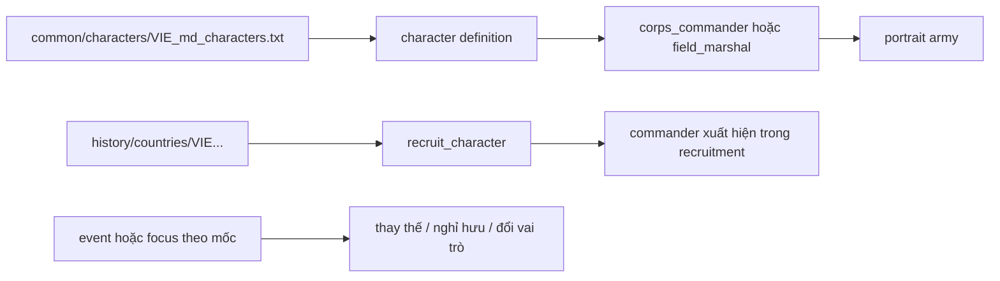

# Báo cáo nghiên cứu: Tướng lĩnh QĐND Việt Nam và hệ thống commander trong Millennium Dawn

**Ngày:** 01/10/2026  
**Phạm vi:** 2000 đến hiện tại; phục vụ thiết kế commander/field marshal cho quốc gia VIE trong submod Millennium Dawn.

> Báo cáo này đã kiểm tra trực tiếp roster VIE của Millennium Dawn trên GitHub. Roster Lục quân hiện được mở rộng lên khoảng 20 người: dùng roster upstream và thêm 7 commander cấp quân đoàn/quân khu/sư đoàn bằng ID riêng.

## 1. Kết luận điều hành

1. Trong giai đoạn 2000-nay, ba trục nhân sự có giá trị mô phỏng nhất là **Bộ trưởng Bộ Quốc phòng**, **Tổng Tham mưu trưởng** và **Chủ nhiệm Tổng cục Chính trị**. Không nên biến tất cả sĩ quan cấp cao thành nhân vật có mặt cùng lúc trên bản đồ.
2. Chuỗi Tổng Tham mưu trưởng có thể làm xương sống cho commander lịch sử: **Lê Văn Dũng -> Phùng Quang Thanh -> Nguyễn Khắc Nghiên -> Đỗ Bá Tỵ -> Phan Văn Giang -> Nguyễn Tân Cương**.
3. Chuỗi Bộ trưởng Quốc phòng: **Phạm Văn Trà -> Phùng Quang Thanh -> Ngô Xuân Lịch -> Phan Văn Giang**.
4. Mốc tổ chức quân đội quan trọng để gắn vào focus/event không chỉ là cá nhân: thành lập **Quân đoàn 12** năm 2023, **Quân đoàn 34** năm 2024 và hợp nhất Hậu cần - Kỹ thuật công bố ngày 05/02/2025.
5. Millennium Dawn upstream đã có `common/characters/VIE.txt` và history VIE đã `recruit_character` roster tương ứng. Submod chỉ thêm các commander mới bằng prefix riêng `VIE_army_`, không định nghĩa lại ID upstream.
6. `create_country_leader` trong repo là cơ chế lãnh đạo chính trị. Không dùng nó để mô phỏng tướng quân đội. Tướng phải đi qua character/commander system của MD/HOI4.

## 2. Cấu trúc chỉ huy cần mô phỏng

### 2.1. Bộ trưởng Bộ Quốc phòng

Đây là vị trí chính trị-quân sự cấp cao nhất trong hệ thống Bộ Quốc phòng, phù hợp nhất với country leader/minister-level representation, không phải general trực tiếp chỉ huy một quân đoàn trong gameplay.

| Giai đoạn | Bộ trưởng | Ý nghĩa thiết kế |
|---|---|---|
| 2000-2006 | Phạm Văn Trà | Giai đoạn chuyển tiếp đầu thế kỷ, duy trì hệ thống tổ chức và hiện đại hóa nền tảng |
| 2006-2016 | Phùng Quang Thanh | Cầu nối trực tiếp với chức Tổng Tham mưu trưởng; phù hợp nhân vật có cả vai trò chính trị và quân sự |
| 2016-2021 | Ngô Xuân Lịch | Gắn với Tổng cục Chính trị và quản trị chính trị-quân đội |
| 2021-nay | Phan Văn Giang | Bộ trưởng hiện tại; trước đó là Tổng Tham mưu trưởng, phù hợp chuỗi chuyển vai trò |

### 2.2. Tổng Tham mưu trưởng

Đây là tuyến commander quan trọng nhất để đưa vào gameplay vì chức vụ gắn với chỉ huy, tham mưu chiến lược và sẵn sàng chiến đấu.

| Thời gian gần đúng | Tổng Tham mưu trưởng | Ghi chú áp vào mod |
|---|---|---|
| Đầu giai đoạn 2000-05/2001 | Lê Văn Dũng | Chỉ cần đưa vào nếu muốn mô phỏng chính xác năm 2000-2001 |
| 05/2001-08/2006 | Phùng Quang Thanh | Commander/field marshal lịch sử của giai đoạn đầu |
| 08/2006-11/2010 | Nguyễn Khắc Nghiên | Gắn với chỉ huy chiến lược và tổ chức lực lượng |
| 11/2010-05/2016 | Đỗ Bá Tỵ | Đã có portrait trong repo: `Portrait_Do_Ba_Ty.dds` |
| 05/2016-06/2021 | Phan Văn Giang | Có thể dùng làm field marshal trước khi chuyển sang Bộ trưởng |
| 06/2021-nay | Nguyễn Tân Cương | Tổng Tham mưu trưởng hiện tại; nên là nhân vật active trong bookmark hiện đại |

### 2.3. Tổng cục Chính trị

Chủ nhiệm Tổng cục Chính trị không nên bị gộp máy móc vào field marshal. Vai trò này phù hợp với chief-of-army advisor, national spirit hoặc modifier về tổ chức, chính trị và ổn định quân đội.

Các nhân vật cần theo dõi trong giai đoạn này:

- Lê Văn Dũng: sau thời kỳ Tổng Tham mưu trưởng chuyển sang vai trò chính trị cấp cao trong quân đội.
- Ngô Xuân Lịch: Chủ nhiệm Tổng cục Chính trị trước khi làm Bộ trưởng.
- Lương Cường: giữ vai trò Chủ nhiệm Tổng cục Chính trị trong giai đoạn 2016-2024, sau đó chuyển sang vị trí chính trị nhà nước.
- Nguyễn Trọng Nghĩa: tên đã có trong danh sách character reference của repo; cần xác minh đúng thời điểm và chức vụ trước khi gán trait.

## 3. Các tướng/nhân vật quân sự đang được repo dự kiến

Bản reference `tools/audit/md_ref/VIE_country.txt` gọi `recruit_character` cho 19 ID:

`VIE_Nguyen_Chi_Vinh`, `VIE_Ngo_Xuan_Lich`, `VIE_Phi_Quoc_Tuan`, `VIE_Nguyen_Quang_Dam`, `VIE_Nguyen_Tan_Cuong`, `VIE_Nguyen_Trong_Nghia`, `VIE_Pham_Hoai_Nam`, `VIE_Pham_Kim_Hau`, `VIE_Pham_Van_Hung`, `VIE_Phan_Van_Giang`, `VIE_Tran_Don`, `VIE_Tran_Quang_Phuong`, `VIE_Tran_Viet_Khoa`, `VIE_Vo_Minh_Luong`, `VIE_Vo_Trong_Viet`, `VIE_Le_Xuan_Duy`, `VIE_Hoang_Xuan_Chien`, `VIE_Dinh_Gia_That`, `VIE_Be_Xuan_Truong`.

### Phân loại dùng cho bước tiếp theo

| Nhóm | Nhân vật nên ưu tiên | Cách dùng |
|---|---|---|
| Chỉ huy chiến lược | Phan Văn Giang, Nguyễn Tân Cương, Đỗ Bá Tỵ, Phùng Quang Thanh | Field marshal hoặc corps commander tùy cấp độ bookmark |
| Quản trị quốc phòng | Ngô Xuân Lịch, Nguyễn Chi Vịnh, Hoàng Xuân Chiến, Võ Minh Lương, Phạm Hoài Nam | Chief-of-army / advisor / commander theo hồ sơ xác minh |
| Hải quân | Phạm Hoài Nam, Nguyễn Quang Đạm, Phạm Kim Hậu | Naval commander; cần xác minh chức vụ và thời gian từng người |
| Chính trị-quân đội | Nguyễn Trọng Nghĩa, Trần Quang Phương, Bế Xuân Trường | Political advisor hoặc chief-of-army, không tự động gán field marshal |
| Chỉ huy quân khu/binh chủng | Trần Đơn, Võ Trọng Việt, Lê Xuân Duy, Đinh Gia Thất, Trần Việt Khoa | Corps commander nếu có hồ sơ chức vụ phù hợp |
| Chưa đủ dữ kiện trong repo | Phi Quốc Tuấn, Nguyễn Quang Đạm, Phạm Kim Hậu, Phạm Văn Hùng và một số ID khác | Không gán trait mạnh trước khi xác minh chức vụ, quân chủng và thời gian |

> Bảng trên là phân loại thiết kế, không phải khẳng định tất cả chức danh. Các tên chưa có hồ sơ nguồn riêng phải được kiểm tra qua Bộ Quốc phòng, QĐND, TTXVN hoặc hồ sơ chính thức trước khi ghi vào localization.

## 3.1. Lớp chỉ huy thấp hơn: quân đoàn, quân khu, sư đoàn và lữ đoàn

### Quân đoàn 12

| Chức vụ | Nhân vật | Mốc dùng trong mod |
|---|---|---|
| Tư lệnh | Trung tướng Lê Xuân Thuân | Từ 24/04/2025; commander cấp quân đoàn trong bookmark hiện đại |
| Chính ủy | Thiếu tướng Trần Đại Thắng | Political/organization advisor hoặc chính ủy cấp quân đoàn |
| Phó tư lệnh kiêm Tham mưu trưởng | Thiếu tướng Nguyễn Thành Phố | Planning/logistics commander phụ |
| Giai đoạn đầu thành lập | Thiếu tướng Trương Mạnh Dũng | Có thể dùng cho event 2023-2025 nếu mô phỏng quá trình thành lập |

Các đơn vị trực thuộc phù hợp để làm scope/commander gồm Sư đoàn 308, 312, 325, 390; Lữ đoàn Tăng - Thiết giáp 203; Lữ đoàn Pháo binh 164 và 368; Lữ đoàn Phòng không 241 và 673; Lữ đoàn Công binh 299; Trung đoàn Thông tin 140. Đây là danh sách tổ chức, chưa phải roster commander từng đơn vị.

### Quân đoàn 34

| Chức vụ | Nhân vật | Mốc dùng trong mod |
|---|---|---|
| Tư lệnh | Trung tướng Đào Tuấn Anh | Từ 24/04/2025; commander cấp quân đoàn hiện đại |
| Chính ủy | Trung tướng Lê Minh Quang | Political/organization advisor |
| Phó tư lệnh kiêm Tham mưu trưởng | Thiếu tướng Trần Công Đức | Planning/coordination commander phụ |
| Chỉ huy giai đoạn công bố thành lập | Thiếu tướng Nguyễn Bá Lực | Giữ trong event 12/2024 như tư lệnh ban đầu được công bố tại lễ thành lập |

Các đơn vị nổi bật gồm Sư đoàn 9, 10, 31, 320; Lữ đoàn Pháo binh 40 và 434; Lữ đoàn Phòng không 71 và 234; Lữ đoàn Tăng 273; Lữ đoàn Công binh 7; Trung đoàn Thông tin 29. Chưa gán commander cấp dưới nếu chưa có mốc bổ nhiệm rõ.

### Quân khu 7

Quân khu là cấp phù hợp với field marshal/army-group commander hơn là commander của một division cụ thể.

| Chức vụ | Nhân vật | Khoảng thời gian/ghi chú |
|---|---|---|
| Tư lệnh hiện nay | Trung tướng Lê Xuân Thế | Từ 28/06/2025 |
| Chính ủy hiện nay | Trung tướng Trần Vinh Ngọc | Nhiệm kỳ hiện tại |
| Phó tư lệnh kiêm Tham mưu trưởng | Thiếu tướng Lê Xuân Bình | Từ 2025 |
| Tư lệnh giai đoạn 2011-2015 | Trần Đơn | Sau đó là Thứ trưởng Bộ Quốc phòng; ID đã có trong repo |
| Tham mưu trưởng 2011-10/2015 | Võ Minh Lương | Sau đó là Thứ trưởng; ID đã có trong repo |
| Tư lệnh giai đoạn 2004-2009 | Lê Mạnh | Cần bổ sung portrait/character nếu mô phỏng đầy đủ từ năm 2000 |

Các đơn vị phù hợp để mở rộng roster gồm Sư đoàn 5, 7, 302, 309; Lữ đoàn Pháo binh 75; Lữ đoàn Phòng không 77; Lữ đoàn Công binh 25 và 550; Lữ đoàn Tăng - Thiết giáp 26; Lữ đoàn Thông tin 23. Bản đầu chỉ nên đưa tư lệnh quân khu vào gameplay; commander cấp sư đoàn/lữ đoàn nên được tuyển theo event hoặc decision riêng.

### Quy tắc nghiên cứu cấp sư đoàn/lữ đoàn

Ở cấp thấp hơn, một bài báo thường chỉ ghi “tư lệnh đơn vị” tại thời điểm bài viết, không cung cấp đầy đủ lịch sử thay đổi. Mỗi hồ sơ cần lưu bốn trường:

| Trường | Ví dụ |
|---|---|
| Đơn vị | Sư đoàn 308 / Lữ đoàn 203 |
| Chức vụ | Tư lệnh, Chính ủy, Tham mưu trưởng |
| Thời điểm hiệu lực | 2022-2024, không suy ra chỉ từ ngày bài đăng |
| Nguồn | Quyết định bổ nhiệm hoặc bài QĐND/Quân khu |

Không dùng cấp hàm để suy ra chức vụ. Hai thiếu tướng cùng xuất hiện trong một bài có thể là tư lệnh, chính ủy, phó tư lệnh hoặc cán bộ cơ quan.

### Mô hình hóa trong HOI4

- **Quân khu:** field marshal hoặc army-group commander; trait thiên về defense, planning, logistics.
- **Quân đoàn:** corps commander; trait thiên về planning, attack/defense theo hồ sơ.
- **Sư đoàn:** chỉ đưa vào nếu game có division commander; nếu không, đại diện bằng corps commander của đội hình chủ lực.
- **Lữ đoàn/trung đoàn:** không tạo commander quốc gia riêng; dùng event/decision, unit name và modifier tổ chức.
- **Chính ủy:** ưu tiên advisor/character chính trị, không biến thành commander chiến đấu chỉ vì là tướng.

Roster cấp dưới ưu tiên cho bản đầu: Lê Xuân Thuân, Đào Tuấn Anh, Lê Xuân Thế, Trần Đơn, Võ Minh Lương, Nguyễn Bá Lực và Nguyễn Thành Phố. Các tên khác giữ trong bảng nghiên cứu cho tới khi có nguồn xác nhận chức vụ và mốc thời gian.

## 3.2. Roster thực tế trong Millennium Dawn GitHub

Kiểm tra `MillenniumDawn/Millennium-Dawn/common/characters/VIE.txt` cho thấy roster upstream gồm:

| ID | Vai trò trong MD |
|---|---|
| `VIE_Nguyen_Chi_Vinh` | `field_marshal` |
| `VIE_Ngo_Xuan_Lich` | `corps_commander` |
| `VIE_Phi_Quoc_Tuan` | `corps_commander` |
| `VIE_Hyunh_Chien_Thang` | `corps_commander`, nhưng không nằm trong danh sách recruit history hiện tại |
| `VIE_Nguyen_Quang_Dam` | advisor `army_chief` |
| `VIE_Nguyen_Tan_Cuong` | advisor `army_chief` |
| `VIE_Nguyen_Trong_Nghia` | advisor `high_command` |
| `VIE_Pham_Hoai_Nam` | advisor `navy_chief` |
| `VIE_Pham_Kim_Hau` | advisor `navy_chief` |
| `VIE_Pham_Van_Hung` | advisor `high_command` |
| `VIE_Phan_Van_Giang` | advisor `high_command` |
| `VIE_Tran_Don` | advisor `high_command` |
| `VIE_Tran_Quang_Phuong` | advisor `air_chief` |
| `VIE_Tran_Viet_Khoa` | advisor `air_chief` |
| `VIE_Vo_Minh_Luong` | advisor `high_command`, ledger `air` |
| `VIE_Vo_Trong_Viet` | advisor `high_command`, ledger `air` |
| `VIE_Le_Xuan_Duy` | advisor `high_command` |
| `VIE_Hoang_Xuan_Chien` | advisor `army_chief` |
| `VIE_Dinh_Gia_That` | advisor `navy_chief` và `navy_leader` |
| `VIE_Be_Xuan_Truong` | advisor `high_command` |

History VIE upstream tuyển 19 ID, bỏ `VIE_Hyunh_Chien_Thang` dù character vẫn được định nghĩa. Đây là điểm cần nghiên cứu thêm, nhưng không nên tự động tuyển thêm nếu chưa xác định lý do lịch sử/thiết kế.

Upstream dùng đường dẫn portrait trực tiếp như `gfx/leaders/VIE/Portrait_Phan_Van_Giang.dds`, không cần tạo sprite GFX riêng cho character. Schema cũng dùng trait MD chuyên biệt như `army_chief_logistics_2`, `army_armored_1`, `navy_chief_maneuver_2`, `navy_career_officer`.

## 4. Mốc tổ chức nên gắn với gameplay

### 4.1. Quân đoàn 12

- Công bố thành lập ngày 02/12/2023.
- Hình thành trên cơ sở sáp nhập Quân đoàn 1 và Quân đoàn 2.
- Vai trò: quân đoàn chủ lực cơ động chiến lược, tổ chức theo hướng tinh, gọn, mạnh.
- Thiết kế đề xuất: event nền hoặc focus `VIE_to_chuc_quan_doan`, cho modifier tổ chức/cơ động và mở character commander cấp quân đoàn.

### 4.2. Quân đoàn 34

- Công bố thành lập ngày 15/12/2024.
- Hình thành trên cơ sở sáp nhập Quân đoàn 3 và Quân đoàn 4.
- Thiếu tướng Nguyễn Bá Lực được nêu là Tư lệnh tại lễ công bố; từ 24/04/2025, nguồn cập nhật ghi Trung tướng Đào Tuấn Anh giữ chức Tư lệnh.
- Thiết kế đề xuất: event năm 2024 cập nhật commander của quân đoàn và tăng hiệu quả tổ chức lực lượng, không tạo thêm một field marshal quốc gia.

### 4.3. Hợp nhất Hậu cần - Kỹ thuật

- Quyết định 366/QĐ-BQP ngày 24/01/2025.
- Lễ công bố hợp nhất ngày 05/02/2025.
- Đây là mốc phù hợp cho advisor/character phụ trách hậu cần-kỹ thuật, không phải commander chiến đấu.
- Báo QĐND nêu Trung tướng Trần Minh Đức là Chủ nhiệm Tổng cục Hậu cần - Kỹ thuật trong bài năm 2025; cần ghi nguồn và thời điểm rõ nếu đưa vào mod.

## 5. Cơ chế character/commander trong HOI4 và MD

### 5.1. Ba khái niệm cần tách

1. **Country leader:** lãnh đạo chính trị của quốc gia. Repo hiện dùng `create_country_leader` trong `common/scripted_effects/VIE_md_effects.txt` và `VIE_political_leaders.txt`.
2. **Character:** hồ sơ nhân vật có thể được tuyển vào quốc gia. History gọi bằng `recruit_character = VIE_...`.
3. **Commander:** vai trò quân sự của character, thường là `corps_commander` hoặc `field_marshal`, có skill và commander traits. Đây mới là nơi cần áp các tướng quân đội.

### 5.2. Luồng dữ liệu đề xuất

Luồng triển khai nên là:

1. Định nghĩa character trong `common/characters/` theo schema của bản Millennium Dawn đang cài.
2. Gắn `portraits = { army = ... }` hoặc trường portrait tương ứng với schema MD.
3. Gắn block `corps_commander` hoặc `field_marshal` với skill và traits.
4. Gọi `recruit_character` trong history quốc gia VIE.
5. Dùng event theo mốc để thêm, retire hoặc thay commander nếu muốn mô phỏng lịch sử.
6. Kiểm tra trong game và `error.log`; không suy ra schema chỉ từ bản reference của repo.

### 5.3. Skill và trait nên dùng thận trọng

Không nên gán skill theo cấp hàm. Skill nên phản ánh vai trò gameplay:

- `skill`: năng lực tổng hợp.
- `attack_skill`: phù hợp người có hồ sơ chỉ huy tác chiến.
- `defense_skill`: phù hợp chỉ huy phòng thủ/quân khu.
- `planning_skill`: phù hợp tham mưu và tổ chức chiến dịch.
- `logistics_skill`: phù hợp hậu cần-kỹ thuật.

Đề xuất thang khởi điểm bảo thủ:

| Vai trò | Skill tổng | Phân bổ gợi ý |
|---|---:|---|
| Tổng Tham mưu trưởng | 3-4 | planning 3-4, logistics 2-3, attack/defense 2-3 |
| Tư lệnh quân đoàn | 2-3 | attack hoặc defense 2-3, planning 2 |
| Tư lệnh hải quân | 2-3 | attack/defense 2-3, planning 2 |
| Hậu cần-kỹ thuật | Không ưu tiên commander | advisor/logistics trait |
| Chủ nhiệm chính trị | Không ưu tiên commander | stability, organization, army experience advisor |

Không dùng trait “offensive”/“logistics” chỉ vì một người giữ chức vụ cao; cần gắn với hồ sơ và vai trò lịch sử.

## 6. Khoảng trống kỹ thuật hiện tại của repo

### Đã có

- Millennium Dawn GitHub: `common/characters/VIE.txt` định nghĩa roster VIE.
- Millennium Dawn GitHub: `history/countries/VIE - Vietnam.txt` tuyển roster bằng `recruit_character`.
- Repo submod có bản reference tương ứng trong `tools/audit/md_ref/VIE_country.txt` và `VIE_Vietnam.txt`.
- Submod bổ sung `common/characters/VIE_md_army_expansion.txt` với 7 commander Lục quân mới.
- 7 commander mới (cộng Trương Mạnh Dũng, tổng 8) được tuyển bằng event `vie_army_commanders.1` từ `date > 2025.12.31`, không còn tuyển lúc khởi động. Xem `VIE_land_forces_implementation_plan_v2.md`.
- Localization mới nằm trong `localisation/english/VIE_army_commanders_l_english.yml`.
- Portrait VIE cục bộ trong `gfx/leaders/VIE/`: các file có sẵn (Trà, Thanh, Tỵ, Đỗ Bá Tỵ, 7 commander Quân đoàn 12/34...) và 13 ảnh placeholder sinh bằng `tools/build_vie_placeholder_portraits.py`, cùng các portrait VIE còn lại do base Millennium Dawn cung cấp khi game load.
- `recruit_character` list trong `tools/audit/md_ref/VIE_country.txt` và `VIE_Vietnam.txt`.
- Country leader creation và chuyển giao Tổng Bí thư trong `common/scripted_effects/VIE_md_effects.txt`.
- Báo cáo quân sự đã đề xuất mô hình cải cách chỉ huy, quân đoàn 12/34 và hệ thống “tinh, gọn, mạnh”.

### Chưa có / cần làm

- Các portrait placeholder (silhouette trung tính, không phải chân dung thật) cần thay bằng ảnh thật nếu có; ghi đè cùng tên file và bỏ id khỏi `PLACEHOLDERS` trong script.
- Roster đã có hai giai đoạn (2000-2014 và 2015-nay) cộng một mốc phụ 2026: xem `VIE_land_forces_implementation_plan_v2.md`. Cơ chế đổi roster chưa được test trong game.
- Cần kiểm tra version base MD cài thực tế có khớp commit GitHub đã kiểm tra hay không.
- Cần test trong game để xác nhận toàn bộ portrait base và các advisor trait được nạp.

## 7. Lộ trình áp dụng vào mod

### Bước 1: Roster Lục quân khoảng 20 người

Roster nền dùng các character Lục quân upstream; bảy người bổ sung cấp thấp hơn đã được thêm bằng ID riêng. Tổng số khoảng 20 người, không duplicate ID MD.

### Bước 2: Mapping vai trò upstream

- Nguyễn Chí Vịnh: `field_marshal`.
- Ngô Xuân Lịch, Phi Quốc Tuấn, Huỳnh Chiến Thắng: `corps_commander`.
- Đinh Gia Thật: `navy_leader` và `navy_chief`.
- Nguyễn Tân Cương, Hoàng Xuân Chiến: `army_chief`.
- Phạm Hoài Nam, Phạm Kim Hậu: `navy_chief`.
- Nguyễn Quang Đạm: `army_chief`.
- Nguyễn Trọng Nghĩa, Phạm Văn Hùng, Phan Văn Giang, Trần Đơn, Võ Minh Lương, Võ Trọng Việt, Lê Xuân Duy, Trần Quang Phương, Trần Việt Khoa, Bế Xuân Trường: advisor/high command theo `slot` trong file MD.

### Bước 3: Character definitions

Đã kiểm tra schema upstream: `characters -> portraits -> field_marshal/corps_commander/navy_leader/advisor`. File mở rộng chỉ dùng ID `VIE_army_*`; không override ID trong `VIE.txt` của Millennium Dawn.

### Bước 4: Portrait và localization

- Dùng portrait do base MD cung cấp; submod chỉ bổ sung ảnh khi base thiếu hoặc ảnh sai.
- Không tạo lại localization tên nếu base MD đã có key tương ứng.
- Không dùng tên có dấu trong ID nội bộ; localization hiển thị tên tiếng Việt có dấu.

### Bước 5: Việc còn lại: nối lịch sử và mốc thời gian

Bookmark năm 2000 nên có Lê Văn Dũng hoặc Phùng Quang Thanh tùy mốc chính xác của file history. Event chuyển vai trò:

- 2001: Phùng Quang Thanh lên Tổng Tham mưu trưởng.
- 2006: Nguyễn Khắc Nghiên.
- 2010: Đỗ Bá Tỵ.
- 2016: Phan Văn Giang.
- 2021: Nguyễn Tân Cương; Phan Văn Giang chuyển sang Bộ trưởng.
- 2023/2024: cập nhật commander quân đoàn 12/34 nếu hệ mod mô phỏng cấp quân đoàn.

### Bước 6: Test

1. Mở bookmark 2000, kiểm tra recruitment panel.
2. Chuyển ngày qua từng mốc thay tướng.
3. Kiểm tra không có hai commander cùng chức vụ hoặc character bị recruit lặp.
4. Kiểm tra portrait không thiếu và không có lỗi localization.
5. Kiểm tra commander trait có tác động đúng quân đoàn/quân chủng.
6. Đọc `error.log` sau khi vào game và sau khi tuyển tướng.

## 8. Nguồn tham khảo

- [Chief of the General Staff of Vietnam](https://en.wikipedia.org/wiki/Chief_of_the_General_Staff_(Vietnam)) — chuỗi Tổng Tham mưu trưởng và mốc Nguyễn Tân Cương.
- [Minister of Defence of Vietnam](https://en.wikipedia.org/wiki/Minister_of_Defence_(Vietnam)) — chuỗi Bộ trưởng và cấu trúc chức vụ.
- [Báo Lào Cai: thành lập Quân đoàn 34](https://baolaocai.vn/dai-tuong-phan-van-giang-du-le-cong-bo-quyet-dinh-thanh-lap-quan-doan-34-post394811.html) — mốc 15/12/2024, Nguyễn Bá Lực, Nguyễn Tân Cương, Võ Minh Lương.
- [Quân đoàn 12](https://vi.wikipedia.org/wiki/Qu%C3%A2n_%C4%91o%C3%A0n_12_(Vi%E1%BB%87t_Nam)) — Lê Xuân Thuân, Trần Đại Thắng, Nguyễn Thành Phố và hệ thống sư đoàn/lữ đoàn trực thuộc.
- [Quân đoàn 34](https://vi.wikipedia.org/wiki/Qu%C3%A2n_%C4%91o%C3%A0n_34_(Vi%E1%BB%87t_Nam)) — Đào Tuấn Anh, Lê Minh Quang, Trần Công Đức và hệ thống đơn vị trực thuộc.
- [Quân khu 7](https://vi.wikipedia.org/wiki/Qu%C3%A2n_khu_7,_Qu%C3%A2n_%C4%91%E1%BB%99i_nh%C3%A2n_d%C3%A2n_Vi%E1%BB%87t_Nam) — chuỗi chỉ huy quân khu, tham mưu trưởng và danh sách sư đoàn/lữ đoàn.
- [QĐND: bàn giao chức vụ Tư lệnh Quân đoàn 12](https://www.qdnd.vn/quoc-phong-an-ninh/tin-tuc/ban-giao-chuc-vu-tu-lenh-quan-doan-12-827158) — mốc chuyển giao năm 2025.
- [Báo Quân đội nhân dân: tinh gọn Hậu cần - Kỹ thuật](https://www.qdnd.vn/quoc-phong-an-ninh/xay-dung-quan-doi/tinh-gon-to-chuc-bien-che-thuc-hien-thang-loi-nhiem-vu-cong-tac-hau-can-ky-thuat-trong-tinh-hinh-moi-815137) — Quyết định 366/QĐ-BQP và mốc 05/02/2025.
- [Báo cáo Lục quân VIE — Trục 1, 2, 3](Báo cáo Lục quân VIE — Trục 1, 2, 3.md) — nền tổ chức, Quân đoàn 12/34 và đề xuất cải cách chỉ huy.
- [VIE_military_branch_research_report.md](VIE_military_branch_research_report.md) — nền hiện đại hóa và khoảng trống thiết kế quân sự.
- [tools/audit/md_ref/VIE_country.txt](tools/audit/md_ref/VIE_country.txt) — danh sách `recruit_character` reference hiện có.
- [common/scripted_effects/VIE_md_effects.txt](common/scripted_effects/VIE_md_effects.txt) — cơ chế country leader hiện tại.

## 9. Kết luận triển khai

Bước kế tiếp đúng không phải là thêm hàng loạt tướng ngay, mà là **lấy schema character đang chạy của Millennium Dawn, dựng 6-8 nhân vật chắc dữ kiện, nối portrait hiện có, rồi test một bookmark từ 2000 đến 2021**. Sau khi luồng này chạy sạch, mới mở rộng roster theo quân chủng, quân khu và Quân đoàn 12/34.
