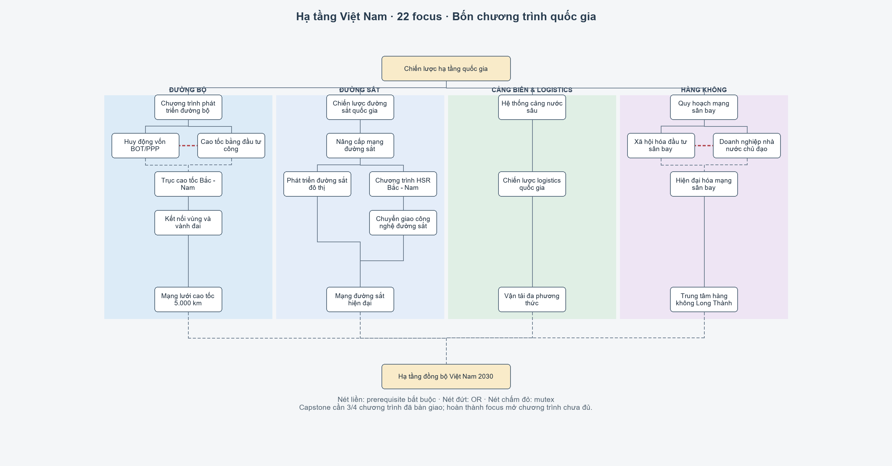

# Hạ tầng Việt Nam — thiết kế v30

Triển khai **09/10/2026** trực tiếp trên `main`, thay thiết kế 44 focus ngày 03/10/2026. **Yêu cầu game mới**, không có migration save cũ. File tĩnh và fixture đã đạt; chưa nghiệm thu trong HOI4.

## Cấu trúc hiện hành

Nhánh có **22 focus**, giữ 16 ID, thêm 6 ID, bỏ 28. Hai cặp mutex khiến một lượt chơi hoàn thành tối đa 20 focus. Tổng cây 438 → **416**. Hash 394 block ngoài hạ tầng giữ nguyên so với baseline bắt đầu triển khai, bao gồm thay đổi chưa commit của người dùng.

Kiểm hash 394/394 đã đạt sau khi thay cây. Ở kiểm tra cuối, 18 focus Lục quân tiếp tục thay đổi trong workspace; giữ nguyên chúng và baseline gốc. Guard baseline hiện báo lỗi, trong khi scenario chức năng hạ tầng vẫn đạt; chi tiết trong báo cáo kiểm định.

Manifest ID/cost/tọa độ/prerequisite/gate và từng đợt đầu tư: [structure.json](.claude/docs/infrastructure/structure.json). Baseline: [baseline.json](.claude/docs/infrastructure/baseline.json). Block đã bỏ: [archive](v30_removed_infrastructure_focuses.txt), ngoài thư mục game nạp.

[Mapping nội dung 28 ID đã bỏ](.claude/docs/infrastructure/retired_mapping.md).

| Nhánh | Chuỗi chương trình | X |
|---|---|---:|
| Chung | Chiến lược quốc gia Y1; Hạ tầng đồng bộ 2030 Y9 | 82 |
| Đường bộ, 6 | Chương trình → BOT/PPP hoặc đầu tư công → Bắc–Nam → kết nối vùng → 5.000 km | 70 |
| Đường sắt, 6 | Chiến lược → hiện hữu → đô thị và HSR/chuyển giao → mạng hiện đại | 78 |
| Cảng/logistics, 3 | Cảng sâu → logistics → đa phương thức | 86 |
| Hàng không, 5 | Quy hoạch → xã hội hóa hoặc doanh nghiệp nhà nước → hiện đại hóa → Long Thành | 94 |

Bốn điểm cuối ở Y7, Y8 để đường hội tụ. Anchor là cha trực tiếp khai báo trước; AND nhiều block, OR một block nhiều focus; mutex hai chiều. Không dời các nhánh khác.

[Sơ đồ trước sửa](.claude/docs/infrastructure/infrastructure_before.png). Hình lấy quan hệ/tọa độ từ mã; không phải ảnh routing/icon trong game.

## Focus mở chương trình; decision thực hiện đầu tư

| Chương trình | Tiền chuẩn tỷ USD / ngày |
|---|---|
| Đường bộ | Nền tảng 7/180; Bắc–Nam 7/365; kết nối vùng 2 × 3,5/180; 3.000 km 10,5/365; mở rộng 5.000 km 4 × 3,5/365 |
| Đường sắt | Hiện hữu 7/365; metro 2 × 3,5/365; đào tạo 1/180; HSR theo đối tác; focus phê duyệt chi thêm 1 tỷ |
| Cảng/logistics | Cảng sâu 2 × 3,5/365; logistics 3,5/180; đa phương thức 3,5/180 |
| Sân bay | Hiện đại hóa 2 × 3,5/365; chuẩn bị Long Thành 2/180; xây Long Thành 3,5/720 |
| Tùy chọn | Vân Đồn 3,5/365 chỉ xã hội hóa; lưỡng dụng 3/180, ngoài gate capstone |

BOT/PPP giảm 25% vốn đường bộ sau nền tảng, thị trường +1, conglomerates opinion +3, event thu phí một lần. Đầu tư công trả đủ, phi tập trung −1 và stability +0,01. Xã hội hóa giảm 25% vốn sân bay dân dụng ngoại trừ chuẩn bị Long Thành; lưỡng dụng không giảm. Doanh nghiệp nhà nước trả đủ, hiệu ứng trục/stability như đầu tư công.

Km gameplay: 400 + 600 + 800 + 1.200 + 2.000 = 5.000. Focus cuối đường bộ cần 1.800 km và kết nối vùng đã bàn giao, chỉ mở đầu tư. Idea cao tốc đổi bậc một lần ở 1.000/3.000/5.000 km, không cộng dồn. Các con số không phải dữ liệu lịch sử công trình.

**Điều chỉnh theo state MD thực:** hai đợt cuối dùng `521/518` thay `801/813`. 813 là Hoàng Sa thuộc CHI ở khởi đầu 2000; 801 là Trường Sa, không phù hợp cao tốc đất liền. Gate và finish kiểm cả sở hữu lẫn kiểm soát state mục tiêu.

## Mốc mở và HSR

Đường bộ 2004, Bắc–Nam 2017, mạng 5.000 km 2022. Đường sắt hiện hữu 2010, metro 2013. Cảng sâu 2011, logistics 2017, đa phương thức 2020. Quy hoạch sân bay 2009, vốn cuối 2011, hiện đại hóa/chuẩn bị Long Thành 2015, xây dựng 2021. Focus công nhận kết quả và capstone không khóa năm riêng.

Event 2010 cho trì hoãn hoặc đầu tư sớm. Đường sớm triển khai HSR từ 2012 khi đủ nền tảng; lịch sử phê duyệt cuối 2024, triển khai cuối 2026. Mở chiến lược sau cuối 2024 mặc định trì hoãn, không thưởng biểu quyết lại.

| Đối tác | Tỷ USD / ngày | Bonus công nghiệp sau đào tạo | Hệ quả |
|---|---|---|---|
| Nhật | 10,5 / 720 | 50%, một lần | Phương Tây +1; quan hệ JAP có guard |
| Châu Âu | 9,5 / 630 | 40%, một lần | Phương Tây +1, hội nhập +1; GER/FRA có guard |
| Trung Quốc | 7,5 / 540 | 30%, một lần | Hội nhập +1; CHI có guard; debt overhang 5 năm khi giải ngân |

Đường sớm nhận debt overhang 10 năm khi thực sự giải ngân, không cộng thêm thời hạn China. Đối tác khóa một lần. Nếu tất cả đối tác biến mất trước chọn, option chờ giữ pending; không chọn thay im lặng. Nước đối tác biến mất sau ký không làm mất đường hoàn thành kỹ thuật.

Mạng đường sắt hiện đại cần nền tảng, hai metro, đào tạo và **đợt triển khai HSR ban đầu**; không khẳng định toàn tuyến khai thác.

## Vòng đời và event

Category `VIE_infrastructure_category` sau root, dành `original_tag = VIE`. 26 định nghĩa decision theo bậc thực hiện các chương trình trên, không tái tạo 28 công trình thành decision riêng.

1. Start kiểm focus/chính sách/bậc, treasury, state và slot ngành; lưu `_paid`, chi qua helper MD, đặt cờ running/busy. Mỗi ngành chỉ một đợt; bốn ngành chạy song song. `cost = 0` là PP, tiền nằm trong effect.
2. `days_remove` giữ thời gian. Finish kiểm đúng bậc/cờ; bàn giao một lần, tăng tiến độ, xóa running và `_paid`. Không dùng `fire_only_once`.
3. Mất sở hữu/kiểm soát trước finish: hoàn `_paid`, không progress/công trình; được thử lại.
4. State đạt trần vẫn ghi nhận tiến độ, không gọi fallback random. Nếu còn chỗ, helper MD xây trong state với `skip_payment = 1` rồi trả 0, không thu lần hai.

Biến/cờ/timer là dữ liệu engine lưu; fixture serialisation đã đạt, save/load thực vẫn cần chơi thử.

Event `.1–3` giữ giám sát chất lượng, BOT, khủng hoảng Vietnam Airlines; `.4` biểu quyết, `.5` đối tác, `.6–9` thông báo 3.000/5.000 km, Long Thành, HSR. Scheduler tôn trọng `VIE_popup_cd`, giữ lựa chọn bắt buộc đến khi hiển thị, catch-up không giải ngân/reward lại. Thông báo không reward. Lựa chọn lặp và nước không tồn tại được guard trong effect.

## Capstone, balance và AI

`VIE_infra_three_programs_ready` đếm đúng 3/4: đường bộ focus cuối + 5.000 km; đường sắt focus mạng hiện đại; cảng focus đa phương thức + bàn giao; hàng không focus Long Thành + bàn giao xây dựng. Không ngành nào bắt buộc riêng. Category/capstone hiển thị trạng thái màu từng ngành.

Capstone PP +50, stability +0,02; idea growth 0,008/trade 0,01. Đa phương thức thay hai idea cảng/logistics. Trần tổng growth modifier **0,088**, trade opinion **0,073**, tốc độ xây infrastructure **0,20**. Không còn `increase_economic_growth` trong nhánh; modifier MD không phải phần trăm GDP trực tiếp.

Tổng công/ACV/Nhật **98,5 tỷ**, BOT/xã hội hóa/China **83,25 tỷ**, chưa gồm event/tùy chọn. AI lịch sử đầu tư công/xã hội hóa/trì hoãn; partner weights 50/50/40 với guard tồn tại. AI decision kiểm tiền/state/slot và mission phá sản; guard AI không khóa focus người chơi.

YML tiếng Việt UTF-8 BOM, comment code không dấu. Reuse sprite MD đã tra, không thêm artwork. Shortcut giữ target root, tên “Hạ tầng quốc gia”.

## Triển khai và kiểm định

Code nằm trong focus hiện tại, `VIE_infra_effects.txt`, triggers/decisions/ideas/loc mới cùng prefix, `VIE_infra_events.txt` và `VIE_infra_loc.txt` scripted localisation. 28 block cũ nằm trong archive cụ thể mà validator loại khỏi script game nạp.

[Kết quả và checklist runtime](.claude/docs/infrastructure/validation.md). Chạy `python tools/audit/infra_scenarios.py` và `python tools/focus_layout/infrastructure_diagram.py`. Không coi kiểm định file là nghiệm thu game.
