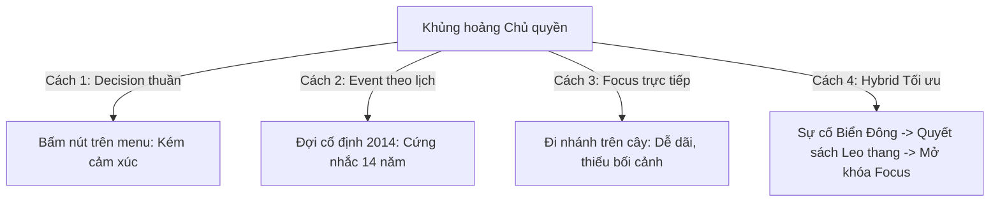

# Báo cáo Nghiên cứu: Tái thiết kế Nhánh giả định Chủ nghĩa Dân tộc (Vietnamese Nationalism)

> **Tài liệu tham chiếu:** `VIE_regime_taxonomy_step1_2.md`, `VIE_three_families_step3.md`, `VIE_transition_graph_step8.md`.  
> **Phạm vi:** Loại bỏ hoàn toàn ý tưởng cũ (`VIE_np_*` và `VIE_lh_*`), xây dựng lại nhánh giả định Chủ nghĩa Dân tộc đúng bản sắc lịch sử – chính trị Việt Nam và xác lập cơ chế điều kiện kích hoạt (Trigger & Decision) tối ưu.

---

## 1. Tóm tắt điều hành (Executive Summary)

1. **Loại bỏ ý tưởng cũ trong mod:** Thiết kế cũ (`VIE_np_*` và `VIE_lh_*`) sao chép máy móc mô hình cực hữu / phát xít phương Tây (thanh trừng sắc tộc, đảng dân quân đường phố lật đổ nhà nước), hoàn toàn xa lạ với cấu trúc chính trị và lịch sử Việt Nam.
2. **Bản chất Chủ nghĩa Dân tộc Việt Nam:** Là **chủ nghĩa dân tộc phòng thủ, khẳng định chủ quyền và tự cường kinh tế** (Defensive & Developmental Nationalism), không bành trướng, lấy mẫu số chung là cội nguồn Hùng Vương, tinh thần Diên Hồng và khối Đại đoàn kết toàn dân tộc.
3. **Cơ chế kích hoạt (Trigger Mechanism):** Không dùng Decision đơn lẻ (vô hồn, thiếu tính cấp bách), cũng không dùng Event ngày cố định đơn thuần (cứng nhắc, bắt chờ 14 năm). Áp dụng **Mô hình Hỗn hợp: "Ngòi nổ & Bàn đạp" (Catalyst + Escalation)** — Cú sốc chủ quyền (HD-981 hoặc Căng thẳng Biển Đông leo thang) kích hoạt chuỗi Quyết sách leo thang có tính chuẩn bị, sau đó chính thức mở khóa nhánh Focus Tree.
4. **Cấu trúc nhánh Tiêu điểm:** Xây dựng theo **4 trụ cột chiến lược**:
   - Trụ cột 1: Ý thức hệ, Cội nguồn & Đại đoàn kết toàn dân tộc.
   - Trụ cột 2: Kinh tế tự lực tự cường ("Make in Vietnam" & National Champions).
   - Trụ cột 3: Chủ quyền Biển đảo & Chiến tranh Nhân dân trên biển.
   - Trụ cột 4: Quốc phòng tự chủ & Răn đe Bất đối xứng (A2/AD).

---

## 2. Vì sao phải loại bỏ ý tưởng cũ trong mod?

Nhánh cũ trong mod gồm 14 focus `VIE_np_*` (National Populist) và 3 focus `VIE_lh_*` (Lạc Hồng) mắc phải 3 sai lầm nền tảng:

| Hạn chế của thiết kế cũ | Bản chất thực tế tại Việt Nam | Hệ quả trong mod |
| :--- | :--- | :--- |
| **Rập khuôn cực hữu phương Tây:** Đưa vào *“Lạc Hồng ethnic nationalism”*, thanh trừng sắc tộc, lập các đoàn thanh niên bán quân sự đường phố kiểu Đức/Ý 1930. | Việt Nam là quốc gia 54 dân tộc anh em. Lịch sử ngàn năm khẳng định truyền thống *“Đồng bào - Con Rồng Cháu Tiên”* và khối *Đại đoàn kết toàn dân tộc*. Không có đất cho chủ nghĩa dân tộc thuần chủng hay bài trừ sắc tộc. | Khiên cưỡng, phi lý, tạo cảm giác kỳ quặc cho người chơi Việt Nam và người chơi quốc tế hiểu về Việt Nam. |
| **Sai lệch cấu trúc quyền lực:** Dân túy đường phố tự phát "lật đổ" nhà nước và quân đội để lên nắm quyền. | Đảng và Quân đội Nhân dân Việt Nam nắm độc quyền vũ lực tuyệt đối và có tính chính danh lịch sử sâu sắc. Mọi sự chuyển hướng dân tộc nếu xảy ra đều bắt nguồn hoặc có sự đồng thuận từ **quân đội và giới tinh hoa an ninh**. | Làm đứt gãy tính liên tục của bộ máy nhà nước; biến mod thành trò chơi viễn tưởng rẻ tiền. |
| **Thiếu chiều sâu cơ chế:** Các focus chỉ tăng % chỉ số tấn công thô sơ, thiếu các bài toán chiến lược. | Chủ nghĩa dân tộc Việt Nam gắn liền với bài toán sinh tử: **Độc lập tự chủ trước nước lớn, bảo vệ thềm lục địa/Biển Đông và tự chủ chuỗi cung ứng.** | Không tạo được gameplay căng thẳng, thiếu sự đánh đổi kinh tế - ngoại giao thực chất. |

---

## 3. Bản chất Chủ nghĩa Dân tộc Việt Nam trong Khoa học Chính trị

Để thiết kế chuẩn xác, cần dựa trên các học thuyết chính trị - lịch sử vững chắc (Paxton 2004; Mann 2004; Johnson 1982; Slater & Wong 2022):

1. **Chủ nghĩa dân tộc phòng thủ & khẳng định chủ quyền (Defensive & Assertive Nationalism):**
   - Hạt nhân tình cảm tối thượng của người Việt là **độc lập dân tộc và toàn vẹn lãnh thổ** (*“Không có gì quý hơn độc lập, tự do”*).
   - Tinh thần dân tộc luôn bùng nổ mạnh mẽ nhất khi chủ quyền biển đảo (Hoàng Sa, Trường Sa, vùng đặc quyền kinh tế EEZ) hoặc biên giới bị đe dọa.
2. **Chủ nghĩa dân tộc phát triển & kinh tế tự cường (Developmental / Economic Nationalism):**
   - Tương đồng với mô hình Đông Á (Hàn Quốc, Đài Loan, Singapore): Đẩy mạnh công nghiệp hóa, hiện đại hóa như một **sứ mệnh cứu quốc**.
   - Trọng tâm: Xây dựng các doanh nghiệp đầu đàn quốc gia (National Champions), phong trào *"Người Việt Nam ưu tiên dùng hàng Việt Nam"*, làm chủ công nghệ cao và tự chủ chuỗi cung ứng (Make in Vietnam).
3. **Chủ nghĩa dân tộc công dân & bao trùm (Civic & Inclusive Nationalism):**
   - Lấy cội nguồn Quốc Tổ Hùng Vương, các vị anh hùng lịch sử (Hai Bà Trưng, Trần Hưng Đạo, Nguyễn Trãi, Quang Trung, Hồ Chí Minh) làm ngọn cờ tập hợp.
   - Gắn kết cộng đồng hơn 5 triệu kiều bào hải ngoại (*“khúc ruột ngàn dặm”*), kêu gọi nguồn lực trí thức và tài chính về phụng sự Tổ quốc.
4. **Học thuyết Chiến tranh Nhân dân hiện đại (Asymmetric Deterrence):**
   - Kết hợp giữa quân đội chính quy tinh nhuệ với thế trận lòng dân và lực lượng bán vũ trang hợp pháp (Dân quân tự vệ biển, ngư dân bám biển).

---

## 4. Nghiên cứu Điều kiện kích hoạt: Decision vs. Event vs. Focus

### 4.1 So sánh 4 phương án kích hoạt



| Phương án | Cách thức vận hành | Ưu điểm | Nhược điểm | Đánh giá |
| :--- | :--- | :--- | :--- | :---: |
| **Cách 1: Chỉ dùng Decision** | Bấm nút trong bảng Quyết sách khi đủ Political Power (PP). | Người chơi chủ động hoàn toàn thời điểm. | **Vô hồn, phi lý:** Một quốc gia không thể tự nhiên "bấm nút" đổi thể chế nếu không có khủng hoảng an ninh kích hoạt. | **Không nên dùng** |
| **Cách 2: Chỉ dùng Event theo lịch** | Chờ đúng tháng 5/2014 (HD-981) game nổ event để rẽ nhánh. | Kể chuyện lịch sử tốt. | **Cực kỳ ức chế (Railroading):** Chơi từ năm 2000 phải đợi 14 năm. Bấm nhầm hoặc chưa đủ stability là mất cả ván chơi. | **Không nên dùng** |
| **Cách 3: Phân nhánh Focus Tree trực tiếp** | Đặt nhánh trên Focus Tree, đi hết focus tiền đề là vào được. | Rất trực quan, dễ nhìn. | Dễ dãi; làm mất đi tính "nguy cấp" của việc chuyển hướng quốc gia. | **Chưa tối ưu** |
| **Cách 4: Mô hình Hỗn hợp (Hybrid)** | **Cú sốc chủ quyền (Event/Căng thẳng)** mở cơ hội → Người chơi dùng **Decision leo thang** → Mở khóa **Focus Tree**. | Kết hợp hoàn hảo giữa cốt truyện chân thực và sự tự do chiến lược của người chơi. | Cần code liên kết mượt mà giữa Event, Decision và cờ Focus. | **KHUYÊN DÙNG (Tối ưu nhất)** |

---

### 4.2 Thiết kế Mô hình tối ưu: "Ngòi nổ & Bàn đạp" (Catalyst + Escalation)

Thay vì bắt người chơi chờ đợi thụ động, thiết kế cung cấp **2 cửa vào linh hoạt**:

```
          [CỬA VÀO 1: LỊCH SỬ]                     [CỬA VÀO 2: ĐỘNG (DYNAMIC)]
     Đến sự kiện HD-981 (Tháng 5/2014)         Căng thẳng Biển Đông leo thang (Tension ≥ 2)
                       │                                       │
                       └───────────────────┬───────────────────┘
                                           ▼
                          【BẬT CHẾ ĐỘ KHỦNG HOẢNG BIỂN ĐẢO】
                                           │
                    ┌──────────────────────┴──────────────────────┐
                    ▼                                             ▼
       [LỰA CHỌN A: KIỀM CHẾ]                        [LỰA CHỌN B: CƯƠNG QUYẾT]
   (Bình thường hóa, giữ Đổi Mới)                 (Mở danh mục Decision leo thang)
                                                                  │
                                                                  ▼
                                                【CHUỖI DECISION LEO THANG DÂN TỘC】
                                                1. Quyết định: "Hải đội Vạn tàu cá"
                                                2. Quyết định: "Chiến dịch Tự lực Tự cường"
                                                3. Quyết định: "Triệu tập Diên Hồng Biển Đông"
                                                                  │
                                                                  ▼
                                                 【MỞ KHÓA NHÁNH FOCUS CHÍNH THỨC】
```

#### Hai cửa vào ngòi nổ (Catalyst):
1. **Cửa vào lịch sử:** Tự động mở khi sự kiện Giàn khoan HD-981 diễn ra vào tháng 5/2014.
2. **Cửa vào động (Chủ động kích hoạt sớm):** Người chơi có thể tự tạo ngòi nổ trước năm 2014 (năm 2005, 2008...) bằng các hành động tuần tra, khẳng định chủ quyền đẩy biến `VIE_scs_tension >= 2`. Khi căng thẳng leo thang, khủng hoảng bùng phát bất kỳ lúc nào.

#### Vai trò của Decision trong mô hình này:
- Decision không phải là nút bấm "biến hình" tức thì, mà đóng vai trò là **"Bàn đạp leo thang" (Escalation Steps)**.
- Khi khủng hoảng nổ ra, game mở danh mục Quyết sách: **"Đối đầu Chủ quyền Biển Đông"**.
- Người chơi thực hiện 2–3 quyết sách chuẩn bị lực lượng và định hình chính trị (tăng War Support, chuẩn bị ngư dân, thông qua nghị quyết tự cường).
- Khi hoàn thành, cờ `VIE_nationalist_unlocked` được kích hoạt, **chính thức mở toàn bộ nhánh Tiêu điểm Chủ nghĩa Dân tộc** trên cây Focus Tree.

---

## 5. Kiến trúc Đề xuất của Nhánh Focus Chủ nghĩa Dân tộc

Nhánh mới gồm **4 trụ cột chiến lược** với nội dung cụ thể:

### Trụ cột 1: Ý thức hệ & Tinh thần Diên Hồng — Đại đoàn kết
- **Hội nghị Diên Hồng thời đại mới:** Tham vấn ý kiến toàn dân và giới cựu chiến binh trước thử thách ngoại xâm; củng cố tính chính danh của đường lối cứng rắn.
- **Hòa hợp Dân tộc & Khúc ruột ngàn dặm:** Xóa bỏ mặc cảm quá khứ, ban hành chính sách ưu đãi đặc biệt thu hút kiều bào hải ngoại về cống hiến chất xám và tài chính.
- **Giáo dục Cội nguồn & Lịch sử Dựng nước:** Khơi dậy hào khí ngàn năm, đưa tinh thần bất khuất của tiền nhân vào giáo dục quốc phòng và truyền thông đại chúng.

### Trụ cột 2: Kinh tế Tự lực Tự cường — "Make in Vietnam"
- **Bảo hộ Sản xuất & Thay thế Nhập khẩu:** Hạn chế nhập khẩu sản phẩm thiết yếu, xây dựng năng lực tự chủ về phân bón, hóa chất, luyện kim và cơ khí chế tạo.
- **Tập đoàn Mũi nhọn Quốc gia (National Champions):** Nhà nước bảo trợ tín dụng cho các doanh nghiệp công nghệ - công nghiệp nòng cốt (Viettel, VinFast, Hòa Phát, PVN).
- **Làm chủ Chuỗi cung ứng Chiến lược:** Khai thác sâu Đất hiếm, bảo đảm an ninh lương thực và năng lượng, tự chủ công nghệ bán dẫn và vật liệu mới.

### Trụ cột 3: Chủ quyền Biển đảo & Chiến tranh Nhân dân trên biển
- **Vạn Tàu cá — Vạn Cột mốc Chủ quyền:** Trang bị máy định vị, hệ thống liên lạc vệ tinh và hỗ trợ nhiên liệu cho ngư dân bám biển; tổ chức Hải đội Dân quân tự vệ biển có tổ chức chặt chẽ.
- **Kiên cố hóa Quần đảo Trường Sa & Nhà giàn DK1:** Xây dựng công sự kiên cố, triển khai radar quét biển tầm xa và đảm bảo hậu cần phòng thủ đảo độc lập.
- **Đấu tranh Pháp lý Quốc tế:** Kiên quyết vận dụng UNCLOS 1982, bác bỏ đường chín đoạn phi lý, nâng cao uy tín quốc tế và khẳng định tính chính nghĩa của Việt Nam.

### Trụ cột 4: Quốc phòng Tự chủ & Răn đe Bất đối xứng (A2/AD)
- **Học thuyết Chống tiếp cận / Từ chối khu vực (A2/AD):** Xây dựng lưới lửa tên lửa bờ đối hải đa tầng, mạng lưới radar cảnh giới và UAV trinh sát ven biển.
- **Công nghiệp Quốc phòng Tự cường:** Đẩy mạnh năng lực của Tổng cục CNQP (hệ thống nhà máy Z) và Viettel, tự chủ đạn dược, súng trường STV, pháo phản lực và thiết bị tác chiến điện tử.
- **Tác chiến Không – Hải hiệp đồng:** Tối ưu hóa năng lực tác chiến của biên đội tàu ngầm Kilo, tàu tên lửa Gepard/Molniya phối hợp với tiêm kích tầm xa.

---

## 6. Đánh đổi Chiến lược (Gameplay Trade-offs) & Hệ trục 9-Axis

Trong HOI4, một nhánh chính trị hấp dẫn bắt buộc phải có **đánh đổi rõ ràng (không có con đường thuần lợi)**:

| Hạng mục | Lợi ích (Buffs) | Cái giá & Rủi ro (Malus) |
| :--- | :--- | :--- |
| **Quân sự & Huy động** | +War Support, +Manpower, tăng mạnh tốc độ đóng tàu/chế tạo vũ khí, tăng sĩ khí và phòng thủ lãnh thổ. | Chi phí ngân sách quốc phòng tăng vọt; cắt giảm chi tiêu an sinh xã hội. |
| **Kinh tế** | Tăng tính tự chủ, giảm phụ thuộc nguyên liệu ngoại, tăng sản lượng công nghiệp nặng nội địa. | Mất nguồn vốn FDI giá rẻ ngắn hạn; tăng trưởng GDP bị chững lại do bảo hộ thương mại. |
| **Ngoại giao** | Được nhân dân đồng lòng ủng hộ, vị thế tự chủ cao. | **Quan hệ với Trung Quốc rơi xuống đáy**, nguy cơ xung đột thực địa hoặc phong tỏa biên giới. Mỹ và phương Tây dè dặt nếu kinh tế đóng cửa quá mức. |

### Tác động lên Hệ trục 9-Axis của Mod:
- `VIE_ax_mob` (Huy động): **+5 đến +8** (quần chúng và dân quân được huy động tối đa).
- `VIE_ax_integ` (Hội nhập): **−4 đến −6** (giảm phụ thuộc thương mại nước ngoài).
- `VIE_ax_checks` (Kiểm soát ngang): **−2 đến −3** (quyền hành tập trung vào an ninh/quốc phòng).
- `VIE_ax_merit` (Kỹ trị): **+2** (kỹ trị công nghiệp quốc phòng và chuyên gia kỹ thuật được trọng dụng).
- `VIE_ax_west` (Thân Tây): Giữ ở mức **trung dung hoặc hơi dương** (Việt Nam tự chủ, không làm chư hầu của bất kỳ bên nào).

---

## 7. Lộ trình Triển khai (Action Plan)

1. **Bước 1 (Dọn dẹp):** Gỡ bỏ các focus `VIE_np_*` và `VIE_lh_*` cũ, xóa bỏ các idea/event rập khuôn cực hữu phương Tây.
2. **Bước 2 (Code Ngòi nổ & Decision):**
   - Bổ sung lựa chọn rẽ nhánh vào event HD-981 (`vie_alt.1`) và cơ chế kích hoạt sớm khi `VIE_scs_tension >= 2`.
   - Tạo danh mục Decision: *"Đối đầu Chủ quyền Biển Đông"* làm bàn đạp leo thang.
3. **Bước 3 (Thiết kế Focus Tree):** Code nhánh Tiêu điểm mới theo 4 trụ cột chiến lược đã nêu (khoảng 15–18 focus súc tích, liên kết chặt chẽ).
4. **Bước 4 (Cân bằng & Bản địa hóa):** Viết localization tiếng Việt chỉn chu, ánh xạ hiệu ứng 9-axis và kiểm tra toàn diện bằng `tools/check_static.py`.
