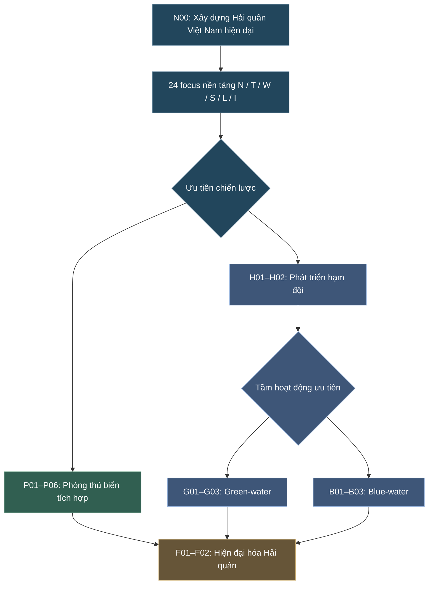

# V34 — Thiết kế hoàn chỉnh nhánh Hải quân Việt Nam
<text color="secondary" size="sm">Hearts of Iron IV: Millennium Dawn · Đề án 40 focus · Xây dựng lại nội dung và học thuyết</text>

Tôi đề xuất lấy **“Từ phòng thủ ven bờ đến Hải quân hiện đại có khả năng làm chủ nhiệm vụ trên biển”** làm chủ đề xuyên suốt của nhánh Hải quân Việt Nam.

Khác với Trung Quốc, Việt Nam không cần một cây focus lấy tàu sân bay, tàu khu trục hạng nặng hoặc tham vọng hạm đội toàn cầu làm đích đến mặc định. Cây mới phải phản ánh được quá trình phát triển lực lượng, khắc phục giới hạn công nghiệp, tổ chức bảo vệ biển đảo và những lựa chọn chiến lược mà người chơi có thể thực hiện.

Về căn cứ thực tế, chính sách quốc phòng công khai của Việt Nam nhấn mạnh tính chất hòa bình, tự vệ, bảo vệ chủ quyền và lợi ích quốc gia. Vì vậy, hướng Blue-water trong game sẽ được xây dựng như một **kịch bản phát triển thay thế**, chứ không phải một kế hoạch hiện hữu của Hải quân Việt Nam. <Cite ref="turn527733search0"/>

## I. Chốt cấu trúc 40 focus

| Trục | Tên | Số focus | Chức năng |
|---|---|---:|---|
| N | Định hướng Hải quân | 1 | Root |
| T | Cải cách và tổ chức | 4 | Huấn luyện, biên chế, chỉ huy |
| W | Hiện đại hóa hạm đội | 5 | Tàu tên lửa, hộ vệ, tàu ngầm, chống ngầm |
| S | Bảo vệ biển đảo | 5 | Cảnh giới, đảo, trinh sát và phối hợp |
| L | Căn cứ và hậu cần | 5 | Quân cảng, bảo dưỡng, tiếp tế, cứu nạn |
| I | Công nghiệp Hải quân | 4 | Đóng tàu, chuyển giao, tích hợp |
| P | Phòng thủ biển tích hợp | 6 | Học thuyết phòng thủ chuyên sâu |
| H | Xây dựng hạm đội | 2 | Nền tảng để lựa chọn Green/Blue |
| G | Green-water Navy | 3 | Hạm đội biển gần và khu vực |
| B | Blue-water Navy | 3 | Hạm đội có khả năng hoạt động biển xa |
| F | Hiện đại hóa Hải quân | 2 | Hội tụ theo chiến lược |
| **Tổng** | | **40** | |

Cây được chia thành 24 focus nền tảng chung và 16 focus thuộc các nhánh lựa chọn hoặc hội tụ.

### Kiến trúc học thuyết

Đây là sơ đồ logic, không phải bản vẽ mọi prerequisite. Các focus nền tảng có thể phát triển song song; người chơi không phải hoàn thành đủ cả 24 focus trước khi được lựa chọn chiến lược.

Ba kết quả cuối cùng là:

- **Phòng thủ biển tích hợp:** Tối ưu khả năng bảo vệ khu vực biển quan trọng và duy trì sức chiến đấu trước lực lượng vượt trội.
- **Green-water Navy:** Xây dựng hạm đội mặt nước và tàu ngầm hiện đại, hoạt động hiệu quả trong vùng biển khu vực.
- **Blue-water Navy:** Đầu tư để có khả năng triển khai và duy trì hạm đội tại những vùng biển xa hơn, với yêu cầu cao về công nghiệp, hậu cần và kỹ thuật.

Green-water và Blue-water là cách mô tả năng lực hoạt động, không phải hai học thuyết đối lập hoàn toàn trong thực tế. Quan hệ loại trừ ở đây chỉ thể hiện việc người chơi chọn **ưu tiên đầu tư chuyên sâu** trong gameplay. <Cite ref="turn527733search36"/>

---

## II. Nội dung 24 focus nền tảng chung

Đây là phần tất cả người chơi đều có thể phát triển, bất kể cuối cùng chọn phòng thủ biển, Green-water hay Blue-water.

### 1. N00 — Định hướng xây dựng Hải quân

**Tên focus:** Xây dựng Hải quân nhân dân Việt Nam trong thế kỷ XXI

**Mục tiêu:** Khởi động chương trình hiện đại hóa Hải quân, xác lập yêu cầu bảo vệ chủ quyền và lợi ích quốc gia trên biển, nâng cao năng lực tác chiến và xây dựng hệ thống bảo đảm phù hợp.

**Gameplay:** Nhận một lượng nhỏ Navy Experience, mở các chương trình tổ chức và công nghiệp. Không cấp tàu chiến miễn phí.

**Điều kiện:** Root quân sự chung của Quân đội nhân dân Việt Nam.

### 2. Trục T — Cải cách tổ chức Hải quân

<text color="secondary" size="sm">4 focus · Xây dựng nhân lực và hệ thống chỉ huy</text>

| Mã | Tên focus | Nội dung và ý nghĩa | Hiệu ứng dự kiến | Điều kiện |
|---|---|---|---|---|
| T01 | **Đánh giá và kiện toàn tổ chức Hải quân** | Rà soát biên chế, lực lượng hiện có, tình trạng kỹ thuật và tổ chức bảo đảm. | Navy XP nhỏ, mở chương trình cải cách. | N00 |
| T02 | **Nâng cao chất lượng sĩ quan và thủy thủ** | Chuẩn hóa đào tạo, thực hành đi biển, huấn luyện khai thác trang bị và các nhiệm vụ đặc thù. | Tăng tốc huấn luyện và kinh nghiệm Hải quân. | T01 |
| T03 | **Kiện toàn lực lượng các vùng Hải quân** | Củng cố năng lực tổ chức, chỉ huy và phối hợp giữa những thành phần lực lượng thuộc các vùng Hải quân. | Cải thiện Organization và hiệu quả tổ chức lực lượng. | T01 |
| T04 | **Hoàn thiện hệ thống chỉ huy hiệp đồng Hải quân** | Chuyển từ phối hợp đơn lẻ sang khả năng quản lý hoạt động của nhiều lực lượng theo nhiệm vụ. | Coordination, Planning; mở hai hướng chiến lược. | T02 + T03 |

Điểm khác bản cũ: bốn focus này không còn là một chuỗi thẳng. T02 và T03 phát triển song song, sau đó cùng hội tụ vào T04.

T03 nói về năng lực tổ chức của hệ thống các vùng Hải quân, không có nghĩa người chơi bắt buộc phải giải thể hoặc thay đổi số lượng vùng Hải quân.

### 3. Trục W — Hiện đại hóa sức mạnh hạm đội

<text color="secondary" size="sm">5 focus · Trang bị và năng lực chiến đấu trên biển</text>

**Mục tiêu:** Phản ánh những bước phát triển quan trọng của Hải quân Việt Nam, không biến cây focus thành danh sách tàu chiến cần mua.

| Mã | Tên focus | Nội dung và ý nghĩa | Hiệu ứng dự kiến | Điều kiện |
|---|---|---|---|---|
| W01 | **Hiện đại hóa lực lượng tàu chiến đấu mặt nước** | Nâng cao khả năng vận hành, bảo dưỡng và sử dụng lực lượng tàu mặt nước hiện có. | Bonus nhỏ Naval Organization, nghiên cứu tàu chiến đấu. | T02 |
| W02 | **Phát triển lực lượng tàu tên lửa cơ động** | Từng bước chuyển đổi lực lượng tàu tên lửa, đưa các phương tiện thế hệ mới như Molniya vào chương trình phát triển. | Research bonus tàu chiến đấu nhanh; mở chương trình Molniya. | W01 |
| W03 | **Tiếp nhận và làm chủ tàu hộ vệ đa nhiệm** | Phát triển khả năng vận hành khinh hạm Gepard và các loại tàu hộ vệ có khả năng thực hiện nhiều nhiệm vụ. | Mở chương trình Gepard; cải thiện hiệu quả tàu hộ vệ. | W01 |
| W04 | **Xây dựng lực lượng tàu ngầm diesel–điện hiện đại** | Phát triển đội ngũ thủy thủ tàu ngầm, cơ sở bảo đảm và chương trình tiếp nhận Kilo 636.1. | Research bonus Submarine, mở mua sắm và đào tạo tàu ngầm. | T02 |
| W05 | **Nâng cao năng lực chống ngầm và tự vệ hạm đội** | Phát triển năng lực sử dụng cảm biến, trang bị chống ngầm và hệ thống phòng vệ trên tàu mặt nước. | ASW, Naval Detection và một số bonus tự vệ tàu. | W03 + S03 |

Một điểm tôi muốn sửa dứt khoát là: **W04 không phụ thuộc W02 hoặc W03.**

Chương trình tàu ngầm, tàu tên lửa và khinh hạm có thể phát triển song song. Chúng chỉ hội tụ ở năng lực phối hợp hạm đội về sau.

Về triển khai game, việc hoàn thành W02, W03 hoặc W04 sẽ mở **Procurement Decisions**. Người chơi phải sử dụng ngân sách và chờ thời gian bàn giao, không nhận ngay một hạm đội hoàn chỉnh.

### 4. Trục S — Năng lực bảo vệ biển đảo

<text color="secondary" size="sm">5 focus · Đặc trưng chiến lược của Hải quân Việt Nam</text>

Đây là trục tôi muốn nâng cấp nhiều nhất so với V33.1.

Thay vì chỉ có radar, sonar và thông tin liên lạc, trục S phải thể hiện năng lực tổ chức bảo vệ biển đảo và phối hợp giữa các thành phần lực lượng.

| Mã | Tên focus | Nội dung và ý nghĩa | Hiệu ứng dự kiến | Điều kiện |
|---|---|---|---|---|
| S01 | **Mở rộng khả năng cảnh giới vùng biển** | Phát triển năng lực nhận biết tình hình trên biển, nâng cao chất lượng thu thập và xử lý thông tin. | Naval Detection, Spotting. | T01 |
| S02 | **Củng cố lực lượng bảo vệ đảo** | Nâng cao điều kiện huấn luyện, bảo đảm kỹ thuật và khả năng phòng thủ của các đơn vị đóng quân trên đảo. | Bonus phòng thủ đảo, mở quyết định đầu tư hạ tầng. | S01 |
| S03 | **Hiện đại hóa trinh sát biển và dưới mặt nước** | Phát triển radar, sonar và khả năng phối hợp các phương tiện trinh sát. | Research bonus cảm biến, Submarine Detection. | S01 |
| S04 | **Hiệp đồng bảo vệ biển đảo** | Nâng cao khả năng phối hợp giữa Hải quân, lực lượng phòng thủ đảo và các lực lượng hỗ trợ. | Coordination/Planning; bonus phòng thủ có điều kiện. | S02 + S03 |
| S05 | **Hình thành hệ thống nhận thức tình hình biển thống nhất** | Hoàn thiện năng lực chia sẻ thông tin để phục vụ chỉ huy và quản lý hoạt động Hải quân. | Capstone S: Detection và Coordination; mở synergy cuối cây. | S04 |

S02 không nên tự động xây những công sự lớn trên mọi đảo. Thay vào đó, nó có thể mở quyết định đầu tư vào các địa bàn người chơi đang kiểm soát hợp pháp trong game.

S04 có thể phối hợp với nhánh Cảnh sát biển, Kiểm ngư hoặc an ninh biển ở cấp quốc gia, nhưng không nên biến các lực lượng thực thi pháp luật thành một phần trực thuộc Hải quân.

Năng lực bảo vệ biển đảo cũng cần phản ánh hoạt động cứu hộ, bảo vệ người dân và duy trì sự hiện diện của nhà nước trên biển. Đây là những nhiệm vụ có cơ sở thực tế, không chỉ là tác chiến hạm đội. <Cite refs={["turn527733search3","turn527733search6"]}/>

### 5. Trục L — Căn cứ, hậu cần và bảo đảm hoạt động

<text color="secondary" size="sm">5 focus · Xương sống duy trì hạm đội</text>

| Mã | Tên focus | Nội dung và ý nghĩa | Hiệu ứng dự kiến | Điều kiện |
|---|---|---|---|---|
| L01 | **Hiện đại hóa căn cứ Hải quân** | Nâng cấp cầu cảng, hạ tầng bảo dưỡng, kho bãi và điều kiện phục vụ hạm đội. | Mở đầu tư Naval Base; cải thiện sửa chữa. | T01 |
| L02 | **Chuẩn hóa hệ thống bảo dưỡng và đại tu** | Nâng cao khả năng sửa chữa, kiểm định và bảo đảm độ tin cậy của tàu trong biên chế. | Repair Speed, giảm chi phí duy trì. | L01 |
| L03 | **Xây dựng hệ thống hậu cần biển đảo** | Tăng năng lực dự trữ, vận tải và hỗ trợ các đơn vị hoạt động xa căn cứ chính. | Cải thiện cung ứng và bảo đảm lực lượng. | L01 |
| L04 | **Phát triển lực lượng tàu hỗ trợ và cứu hộ** | Đầu tư tàu vận tải, cứu nạn, hỗ trợ kỹ thuật và các phương tiện bảo đảm Hải quân. | Mở chương trình tàu hỗ trợ; bonus cứu hộ/sửa chữa qua cơ chế phù hợp. | L02 + L03 |
| L05 | **Nâng cao khả năng duy trì hoạt động dài ngày** | Tổ chức chu kỳ hoạt động, luân phiên lực lượng, bảo dưỡng và tiếp tế một cách bền vững. | Capstone hậu cần: Repair, Range hoặc bonus duy trì hoạt động. | L04 |

**L05 là một trong các focus quan trọng nhất của toàn cây.**

Đối với Green-water, L05 giúp duy trì lực lượng ở biển gần và vùng biển khu vực. Đối với Blue-water, nó là điều kiện nền tảng trước khi tiến lên hoạt động xa hơn.

L05 không phải focus xây dựng Blue-water, mà là **năng lực hậu cần tối thiểu cần thiết để phát triển lên các cấp độ cao hơn**.

### 6. Trục I — Công nghiệp Hải quân Việt Nam

<text color="secondary" size="sm">4 focus · Phát triển công nghiệp tàu quân sự</text>

Tôi đề xuất tinh gọn trục này còn bốn focus lớn, tập trung vào những bước tiến công nghiệp có ý nghĩa thay đổi năng lực thực tế.

| Mã | Tên focus | Nội dung và ý nghĩa | Hiệu ứng dự kiến | Điều kiện |
|---|---|---|---|---|
| I01 | **Củng cố nền công nghiệp đóng tàu quân sự** | Phát triển nhân lực, cơ sở kỹ thuật và năng lực đóng – sửa chữa tàu quân sự. | Bonus Naval Research và sửa chữa. | N00 |
| I02 | **Tiếp nhận công nghệ đóng tàu chiến đấu hiện đại** | Phát triển kỹ thuật thông qua chương trình chuyển giao công nghệ, lấy Molniya làm mốc điển hình. | Bonus sản xuất tàu cỡ nhỏ, nghiên cứu thân tàu. | I01 |
| I03 | **Làm chủ thiết kế và tích hợp hệ thống hạm tàu** | Tăng năng lực thiết kế, chế tạo, tích hợp thiết bị điện tử và hệ thống trên tàu. | Bonus nghiên cứu công nghệ hải quân, giảm chi phí dự án. | I01 |
| I04 | **Phát triển thế hệ tàu hộ vệ do Việt Nam đóng mới** | Đưa năng lực công nghiệp vào chương trình phát triển tàu hộ vệ có yêu cầu kỹ thuật cao hơn. | Mở dự án tàu hộ vệ nội địa; bonus công nghiệp Hải quân. | I02 + I03 |

I04 có một mốc thực tế rất phù hợp: Việt Nam đã khởi công đóng mới tàu hộ vệ chống ngầm đa năng tại Sông Thu ngày 10/8/2026, sau đó đặt ky ngày 5/10/2026. Thông tin công khai cho biết chương trình đóng tàu dự kiến kéo dài 36 tháng. Đây là dự án đang triển khai, chưa phải lớp tàu đã hoàn thành và đưa vào biên chế. <Cite refs={["turn751020search1","turn751020search3"]}/>

Vì vậy, **I04 nên mở dự án đóng tàu**, không tự động cấp tàu hoàn chỉnh hoặc tuyên bố Việt Nam đã có khả năng đóng hàng loạt khinh hạm tiên tiến.

Trục I là nhánh độc lập. Người chơi đi theo hướng Blue-water có thể nhập khẩu tàu và công nghệ nếu không hoàn thành I04, nhưng sẽ chịu chi phí và mức độ phụ thuộc lớn hơn.

---

## III. Học thuyết P — Phòng thủ biển tích hợp

<text color="secondary" size="sm">6 focus · Integrated Maritime Defense · Loại trừ H01</text>

<AsyncImageGroup query={["Vietnam People's Navy coastal defense missile Bastion P", "Vietnam Navy island defense soldiers Truong Sa island", "Vietnam People's Navy missile boat at sea"]} aspectRatio="5:3" layout="carousel"/>

### Mục tiêu xây dựng

Học thuyết P không có nghĩa Hải quân Việt Nam chỉ phòng thủ ven bờ. Đây là định hướng **ưu tiên xây dựng hệ thống phòng thủ biển có chiều sâu**, trong đó các thành phần trên biển, trên bờ và trên đảo cùng tham gia bảo vệ các khu vực trọng yếu.

Khác với việc đầu tư lớn vào khả năng triển khai hạm đội biển xa, người chơi dành nguồn lực cho năng lực phòng thủ, cảnh giới, dự trữ và duy trì sức chiến đấu.

### Sáu focus của nhánh P

| Mã | Tên focus | Nội dung chiến lược | Hiệu ứng gameplay | Điều kiện |
|---|---|---|---|---|
| P01 | **Lựa chọn chiến lược phòng thủ biển tích hợp** | Xác lập ưu tiên bảo vệ biển đảo và duy trì năng lực phòng thủ trước lực lượng mạnh hơn. | Chọn học thuyết P, mở spirit phòng thủ. | T04 + W01; loại trừ H01 |
| P02 | **Xây dựng mạng lưới phòng thủ bờ – đảo** | Nâng cao khả năng phối hợp giữa cảnh giới, lực lượng trên đảo và các đơn vị bảo vệ vùng biển. | Bonus nhận biết tình hình và phòng thủ khu vực. | P01 + S02 |
| P03 | **Củng cố lực lượng bảo vệ các địa bàn biển đảo** | Nâng cao năng lực sẵn sàng, huấn luyện và bảo đảm hậu cần cho lực lượng phòng thủ. | Tăng khả năng duy trì phòng thủ; mở Decision tăng cường bảo đảm. | P01 + L03 |
| P04 | **Hiện đại hóa năng lực phòng thủ biển nhiều lớp** | Nâng cao khả năng phối hợp giữa tàu chiến, phòng thủ ven bờ và các thành phần hỗ trợ. | Bonus phòng thủ có điều kiện, nghiên cứu trang bị phòng thủ biển. | P02 |
| P05 | **Hiệp đồng tác chiến phòng thủ biển** | Tăng năng lực phối hợp của lực lượng mặt nước, tàu ngầm, phòng thủ bờ và hàng không. | Naval Coordination, Detection; synergy với W04/S05. | P03 + P04 |
| P06 | **Hoàn thiện thế trận phòng thủ biển chủ động** | Hình thành mô hình phòng thủ có khả năng duy trì hoạt động, bảo toàn lực lượng và phối hợp nhiều thành phần. | Capstone P: nâng cấp spirit, tăng sức bền và hiệu quả phòng thủ khu vực. | P05 |

### Gameplay đặc trưng

<box border radius="lg" padding={3} gap={2}>
  <row align="center" gap={2}>
    <icon name="shield" color="secondary"/>
    **Phòng thủ biển có chiều sâu**
  </row>
  Người chơi có thể đầu tư để nâng cao hiệu quả phòng thủ tại những khu vực chiến lược đang kiểm soát, cải thiện khả năng duy trì lực lượng và tăng hiệu quả phối hợp giữa những đơn vị khác nhau.

  <divider color="subtle"/>
  **Điểm mạnh:** Phòng thủ khu vực, duy trì lực lượng, hiệu quả đầu tư tương đối tốt, phù hợp khi đối mặt với hạm đội mạnh hơn.

  **Điểm yếu:** Ít lợi thế về triển khai hạm đội xa căn cứ, phạm vi hoạt động và khả năng hộ tống dài ngày.
</box>

**P06 là kết quả cuối của lựa chọn chiến lược phòng thủ**, không phải toàn bộ cây Hải quân. Người chơi vẫn có thể tiếp tục phát triển các chương trình công nghiệp, tàu ngầm và tàu hộ vệ trong phần chung.

---

## IV. Hướng H — Phát triển hạm đội hiện đại

<text color="secondary" size="sm">2 focus nền · Fleet Development · Loại trừ P01</text>

<AsyncImage query="Vietnam People's Navy Gepard 3.9 frigate formation at sea" aspectRatio="16:9" maxHeight={260}/>

Đây là hướng lựa chọn đối lập với việc ưu tiên chuyên sâu năng lực phòng thủ biển.

**Tư tưởng trung tâm:** Tăng tỷ trọng đầu tư cho các biên đội tàu có khả năng hoạt động xa căn cứ, làm chủ nhiều nhiệm vụ và duy trì hiện diện trên biển.

| Mã | Tên focus | Nội dung chiến lược | Hiệu ứng gameplay | Điều kiện |
|---|---|---|---|---|
| H01 | **Ưu tiên xây dựng hạm đội tác chiến hiện đại** | Chuyển trọng tâm đầu tư sang lực lượng tàu chiến có khả năng thực hiện nhiều nhiệm vụ. | Mở spirit Fleet Development, bonus Organization/Research tàu chiến. | T04 + W01; loại trừ P01 |
| H02 | **Hình thành các biên đội tàu tác chiến đa nhiệm** | Xây dựng năng lực phối hợp tàu hộ vệ, tàu hỗ trợ và các thành phần khác để thực hiện nhiệm vụ khu vực. | Coordination, Screening; mở Green-water và Blue-water. | H01 + W03 + L02 |

H02 là mốc rất quan trọng.

Nó xác nhận Hải quân đã có **nền tảng hoạt động Green-water cơ bản**, nên người chơi không phải hoàn thành nhánh G để được chọn B. Hai nhánh G và B là lựa chọn **đầu tư chuyên sâu**, không phải hai cấp độ tồn tại hoàn toàn tách biệt.

Sau H02, người chơi phải lựa chọn ưu tiên cuối:

- G01: Green-water Navy.
- B01: Blue-water Navy.

Hai focus này loại trừ nhau.

---

## V. Học thuyết G — Hải quân Green-water hiện đại

<text color="secondary" size="sm">3 focus · Regional Green-water Fleet</text>

<AsyncImageGroup query={["Vietnam Navy Gepard class frigate 016 Quang Trung", "Vietnam Navy Molniya missile boats formation", "Vietnam Navy naval helicopter Ka-28 frigate"]} aspectRatio="5:3" layout="carousel"/>

### Mục tiêu xây dựng

Đây nên là **con đường phát triển sát thực tế nhất** khi người chơi muốn mở rộng năng lực hạm đội Việt Nam mà vẫn phù hợp với điều kiện công nghiệp và nguồn lực của đất nước.

Green-water trong V34 không phải hải quân chỉ hoạt động sát bờ. Nó là lực lượng có khả năng hoạt động ở biển gần, vùng biển ngoài khơi và các khu vực biển lân cận, nhưng chưa có năng lực duy trì triển khai xa trên quy mô lớn như Blue-water.

| Mã | Tên focus | Nội dung chiến lược | Hiệu ứng gameplay | Điều kiện |
|---|---|---|---|---|
| G01 | **Định hướng xây dựng Hải quân biển gần hiện đại** | Ưu tiên hạm đội có khả năng hoạt động khu vực, phù hợp khả năng kinh tế và bảo đảm kỹ thuật. | Chọn Green-water, bonus tàu mặt nước và hiệu quả hoạt động khu vực. | H02; loại trừ B01 |
| G02 | **Hiện đại hóa lực lượng tàu hộ vệ và chống ngầm** | Nâng cao chất lượng khinh hạm, tàu hộ tống và khả năng phối hợp chống ngầm. | Research bonus Frigate/Corvette, ASW và Screening. | G01 + W05 |
| G03 | **Xây dựng hạm đội biển gần có năng lực tự chủ tác chiến** | Hoàn thiện tổ chức hạm đội đa nhiệm có khả năng hoạt động ổn định trong vùng biển khu vực. | Capstone G: Organization, Coordination, ASW và khả năng duy trì hoạt động khu vực. | G02 + L03 |

### Nội dung phát triển trang bị

G02 có thể mở chương trình tàu hộ vệ mới với các hướng đầu tư như cải tiến Gepard, tiếp nhận tàu hộ vệ hiện đại từ đối tác hoặc phát triển tàu hộ vệ trong nước.

Nếu người chơi hoàn thành I04, chương trình tàu hộ vệ nội địa sẽ có lợi thế riêng về chi phí dài hạn hoặc khả năng bảo dưỡng.

Nếu chưa có I04, người chơi vẫn có thể tiến hành chương trình mua sắm nước ngoài.

**Capstone G03:** Một Hải quân Green-water mạnh, có đội tàu mặt nước đa nhiệm, tàu ngầm hỗ trợ, năng lực chống ngầm và khả năng duy trì hiện diện khu vực.

---

## VI. Học thuyết B — Phát triển Hải quân Blue-water

<text color="secondary" size="sm">3 focus · Blue-water Fleet · Hướng phát triển lịch sử thay thế</text>

<AsyncImageGroup query={["Modern frigate warship ocean replenishment at sea", "Fleet replenishment auxiliary naval ship refueling warship at sea", "Modern ocean going destroyer and frigate task group open ocean"]} aspectRatio="5:3" layout="carousel"/>

### Mục tiêu xây dựng

Blue-water phải là lựa chọn tham vọng nhất của nhánh Hải quân Việt Nam.

Nhưng tôi không đề nghị xây dựng ba focus theo trình tự *tàu khu trục → tàu sân bay → hạm đội toàn cầu*. Cách đó vừa sao chép Trung Quốc vừa bỏ qua giới hạn thực tế của Việt Nam.

Thay vào đó, Blue-water cần phát triển theo ba bước:

**Tổ chức triển khai xa → hình thành năng lực bảo đảm biển xa → duy trì lực lượng hải quân ở khoảng cách lớn trong thời gian dài.**

| Mã | Tên focus | Nội dung chiến lược | Hiệu ứng gameplay | Điều kiện |
|---|---|---|---|---|
| B01 | **Khởi động chương trình Hải quân biển xa** | Đặt mục tiêu mở rộng tầm hoạt động của hạm đội vượt ra ngoài phạm vi bảo đảm khu vực thông thường. | Chọn Blue-water, mở chương trình nghiên cứu và đầu tư biển xa. | H02 + L05 + điều kiện công nghệ/kinh tế; loại trừ G01 |
| B02 | **Xây dựng hạm đội có khả năng triển khai dài ngày** | Phát triển các tàu có khả năng đi biển xa, tổ chức biên đội và tăng năng lực tiếp tế – bảo đảm. | Research bonus tàu đi biển xa, Naval Range và tổ chức lực lượng. | B01 + S04 |
| B03 | **Hình thành năng lực tác chiến Hải quân biển xa bền vững** | Hoàn thiện khả năng triển khai, duy trì, bảo dưỡng và chỉ huy hạm đội trong các hoạt động xa căn cứ. | Capstone B: tăng Range, Coordination và hiệu quả duy trì hoạt động biển xa. | B02 |

### Những năng lực cần có trước B01

Blue-water không nên là lựa chọn rẻ, có thể hoàn thành ngay trong giai đoạn 2000–2010.

B01 cần kiểm tra các điều kiện như trình độ công nghệ hải quân, khả năng duy trì hạm đội thông qua L05, năng lực đóng hoặc tiếp nhận tàu, ngân sách và cơ sở bảo đảm.

Không bắt buộc phải có tàu sân bay, tàu ngầm hạt nhân hay khu trục hạm vạn tấn. Những dự án này có thể được xây dựng thành nội dung mở rộng sau B03 nếu người chơi muốn tiến xa hơn.

Và cũng không nên coi hoàn thành B03 là Việt Nam lập tức sở hữu một hạm đội ngang với các cường quốc hải quân. Nó chỉ xác lập một **năng lực Blue-water ở cấp độ giới hạn, phù hợp quy mô đầu tư của quốc gia trong kịch bản game**.

---

## VII. Hai focus hội tụ cuối cùng

| Mã | Tên focus | Nội dung và ý nghĩa | Hiệu ứng | Điều kiện |
|---|---|---|---|---|
| F01 | **Hoàn thiện học thuyết tác chiến Hải quân** | Đưa lựa chọn chiến lược vào cơ cấu, huấn luyện và hệ thống chỉ huy của Hải quân. | Nâng cấp spirit P/G/B theo hướng đã chọn. | P06 hoặc G03 hoặc B03 |
| F02 | **Xây dựng Hải quân nhân dân Việt Nam chính quy, hiện đại** | Hoàn thiện sự kết hợp giữa lực lượng tác chiến, bảo vệ biển đảo, chỉ huy và bảo đảm kỹ thuật. | Capstone toàn nhánh; bonus riêng cho từng định hướng. | F01 + S05 + L05 |

**F02 không nên cho ba hướng cùng một national spirit giống hệt nhau.**

Phần thưởng phải thay đổi theo học thuyết:

| Định hướng | Hiệu ứng F02 ưu tiên |
|---|---|
| P – Phòng thủ biển | Naval Defense, nhận biết tình hình và khả năng duy trì phòng thủ |
| G – Green-water | Screening, ASW, Organization và phối hợp biên đội |
| B – Blue-water | Naval Range, khả năng duy trì hoạt động và Coordination |

I04 sẽ tạo phần thưởng công nghiệp bổ sung nếu hoàn thành, không phải điều kiện cứng của F02.

---

## VIII. Kiểm tra logic mở khóa toàn bộ V34

Đây là bộ ràng buộc nên dùng làm cơ sở khi viết mã HOI4.

| Focus | Điều kiện bắt buộc |
|---|---|
| T04 | T02 **và** T03 |
| W05 | W03 **và** S03 |
| S04 | S02 **và** S03 |
| L04 | L02 **và** L03 |
| I04 | I02 **và** I03 |
| P01 | T04 **và** W01; loại trừ H01 |
| H01 | T04 **và** W01; loại trừ P01 |
| P05 | P03 **và** P04 |
| H02 | H01, W03 **và** L02 |
| G01 | H02; loại trừ B01 |
| B01 | H02, L05 và ngưỡng công nghệ/kinh tế; loại trừ G01 |
| F01 | P06 **hoặc** G03 **hoặc** B03 |
| F02 | F01 **và** S05 **và** L05 |

### Số lượng focus trong một lượt chơi

| Lựa chọn | Focus hoàn thành tối đa |
|---|---:|
| Phòng thủ biển P | 32 |
| Green-water G | 31 |
| Blue-water B | 31 |

Số lượng focus được mở trong một lượt khác nhau không đồng nghĩa mất cân bằng. Tôi đề nghị đặt tổng cost tham chiếu của hướng P và H+G tương đương nhau; nhánh H+B có chi phí cao hơn và các điều kiện công nghệ nghiêm ngặt hơn.

Ví dụ, chi phí focus đề xuất:

| Tuyến | Tổng cost |
|---|---:|
| P01–P06 | 41 |
| H01–H02 + G01–G03 | 41 |
| H01–H02 + B01–B03 | 44 |

Các con số là điểm khởi đầu để cân bằng, chưa phải giá trị đã playtest. Sức mạnh thực tế còn phụ thuộc công nghệ, ngân sách, trang bị và hệ thống kinh tế Millennium Dawn.

---

## IX. Chuẩn hóa bố cục theo kiểu Cánh Buồm

Cây focus mới nên giữ cấu trúc mở rộng – hội tụ mà bạn đã lựa chọn, nhưng không ép các nhánh công nghiệp, tàu ngầm và bảo vệ đảo phải phụ thuộc nhau chỉ để tạo hình đối xứng.

<box border radius="lg" padding={3} gap={2}>
  <box background="surface-secondary" padding={3} radius="md" align="center">
    **N00 — Định hướng Hải quân**
  </box>
  <row justify="center">
    <icon name="arrow-down" color="secondary"/>
  </row>
  <grid columns={2} gap={2}>
    <grid-item>
      <box border radius="md" padding={2} align="center">
        **T — Cải cách tổ chức**
      </box>
    </grid-item>
    <grid-item>
      <box border radius="md" padding={2} align="center">
        **I — Công nghiệp Hải quân**
      </box>
    </grid-item>
  </grid>
  <row justify="center">
    <icon name="arrow-down" color="secondary"/>
  </row>
  <grid columns={3} gap={2}>
    <grid-item>
      <box background="surface-secondary" radius="md" padding={2} align="center" gap={1}>
        **S01–S05**
        <caption>Bảo vệ biển đảo</caption>
      </box>
    </grid-item>
    <grid-item>
      <box background="surface-secondary" radius="md" padding={2} align="center" gap={1}>
        **W01–W05**
        <caption>Sức mạnh hạm đội</caption>
      </box>
    </grid-item>
    <grid-item>
      <box background="surface-secondary" radius="md" padding={2} align="center" gap={1}>
        **L01–L05**
        <caption>Hậu cần</caption>
      </box>
    </grid-item>
  </grid>
  <row justify="center">
    <icon name="arrow-down" color="secondary"/>
  </row>
  <grid columns={2} gap={3}>
    <grid-item>
      <box border={{size:1,color:"#588874"}} radius="md" padding={2} gap={2} align="center">
        **P — Phòng thủ biển**
        <text size="xs" color="secondary">P01–P06</text>
        <box background="surface-secondary" radius="sm" padding={2} width="100%" align="center">
          <text size="xs">Capstone P06</text>
        </box>
      </box>
    </grid-item>
    <grid-item>
      <box border={{size:1,color:"#648db4"}} radius="md" padding={2} gap={2} align="center">
        **H — Phát triển hạm đội**
        <text size="xs" color="secondary">H01–H02</text>
        <grid columns={2} gap={1}>
          <grid-item>
            <box background="surface-secondary" radius="sm" padding={2} gap={1} align="center">
              <text size="xs" weight="medium">G01–G03</text>
              <text size="2xs" textAlign="center">Green-water</text>
            </box>
          </grid-item>
          <grid-item>
            <box background="surface-secondary" radius="sm" padding={2} gap={1} align="center">
              <text size="xs" weight="medium">B01–B03</text>
              <text size="2xs" textAlign="center">Blue-water</text>
            </box>
          </grid-item>
        </grid>
      </box>
    </grid-item>
  </grid>
  <row justify="center">
    <icon name="arrow-down" color="secondary"/>
  </row>
  <box background="surface-secondary" padding={3} radius="md" align="center">
    **F01 → F02 · Hải quân hiện đại**
  </box>
  <caption>Đây là kiến trúc nội dung để dựng layout chính thức. Các điều kiện chéo nên xử lý bằng điều kiện mở khóa hoặc synergy để tránh đường nối xuyên qua nhiều tầng.</caption>
</box>

---

## X. Định hướng nội dung theo lịch sử

Cây cần có trình tự phát triển tương ứng với lịch sử Hải quân Việt Nam nhưng vẫn cho phép người chơi thay đổi tiến độ:

| Thời kỳ | Hướng phát triển |
|---|---|
| 2000–2010 | Củng cố lực lượng hiện hữu, nâng cấp tổ chức, huấn luyện, hậu cần và chuẩn bị mua sắm |
| 2010–2020 | Tiếp nhận, làm chủ Gepard, Molniya, Kilo; mở rộng năng lực công nghiệp và kỹ thuật |
| 2020–2030 | Nâng cao khả năng chống ngầm, trinh sát, chỉ huy; phát triển chương trình đóng tàu hộ vệ trong nước |
| 2030 trở đi | Hoàn thiện năng lực phòng thủ hoặc phát triển hạm đội Green-water; có thể theo đuổi Blue-water nếu đủ nguồn lực |

Tất cả mốc sau năm 2030 là **định hướng gameplay giả định**, không phải kế hoạch Hải quân Việt Nam đã được công bố.

## XI. Kết luận — Phương án V34

So với V33.1, phương án mới có sự thay đổi về bản chất:

**V33.1:** Tập trung vào những năng lực Hải quân cần sở hữu, sau đó chọn Sea Denial hoặc Sea Assurance.

**V34:** Xây dựng nền tảng quân sự chung, sau đó đưa ra lựa chọn về mô hình phát triển Hải quân, với ba kết quả chiến lược rõ ràng.

Tôi đề nghị **chốt nội dung 40 focus V34 này làm khung thiết kế mới**. Ưu điểm lớn nhất là ba hướng P/G/B không còn chỉ cộng những modifier gần giống nhau: chúng tạo ra ba mô hình lực lượng có phạm vi hoạt động, yêu cầu đầu tư và cách sử dụng khác nhau.

Ở bước dựng layout chính thức, cần ưu tiên ba nguyên tắc: giữ hình cánh buồm mở rộng rồi hội tụ; thể hiện rõ lựa chọn hai tầng P/H → G/B; và chỉ nối trực tiếp những focus có phụ thuộc thực sự, không đánh đổi logic quân sự để lấy sự cân đối hình học.

---

If you want, I can:

- Tiếp tục mô tả các focus về Green-water Navy
- Mô tả thêm về nhánh Blue-water Navy
- Giải thích các quyết định chiến lược giữa Green-water và Blue-water

